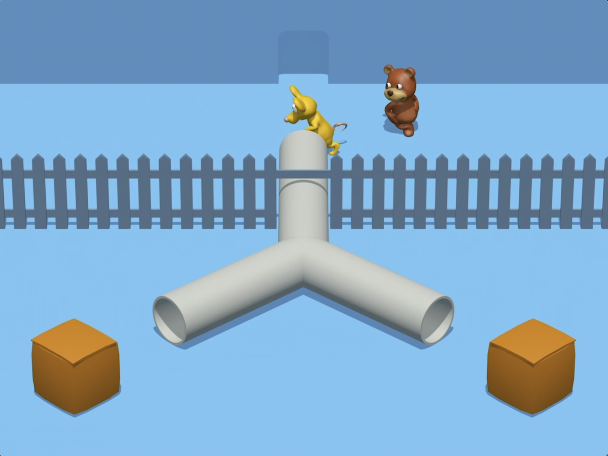
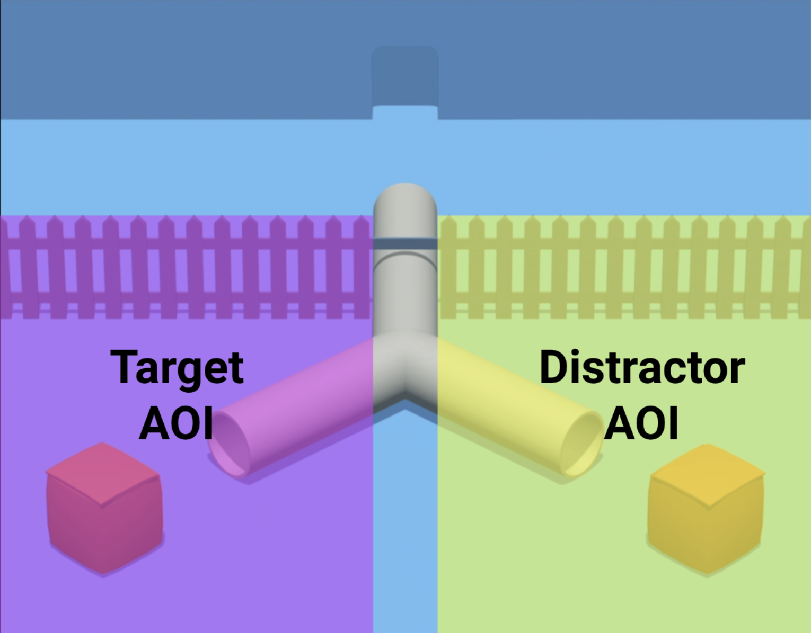
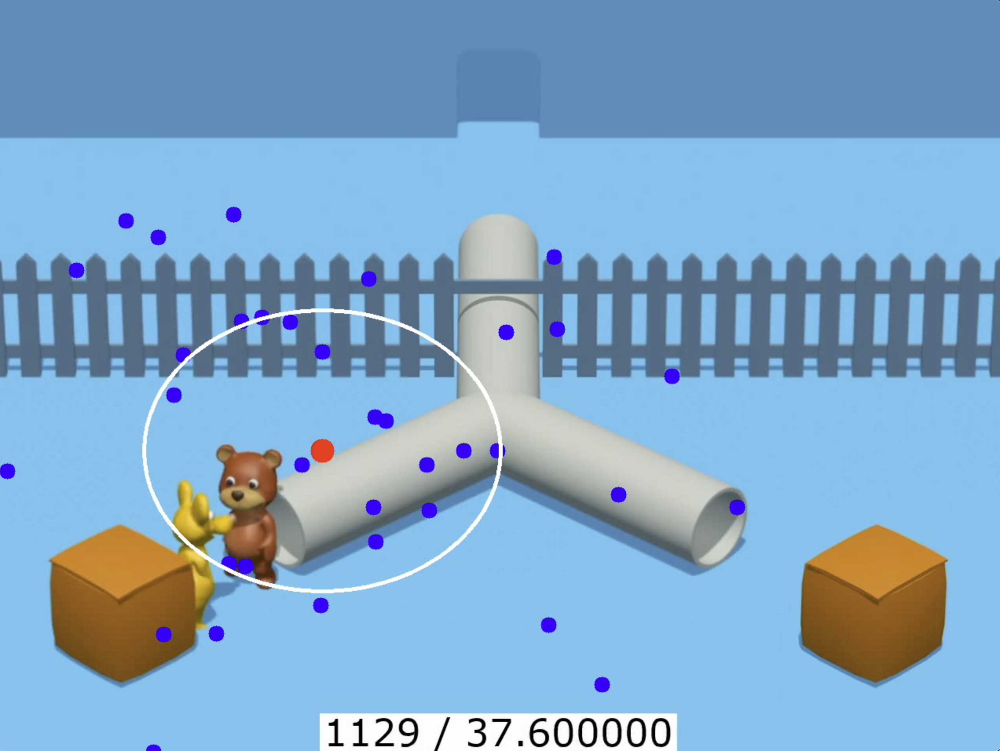
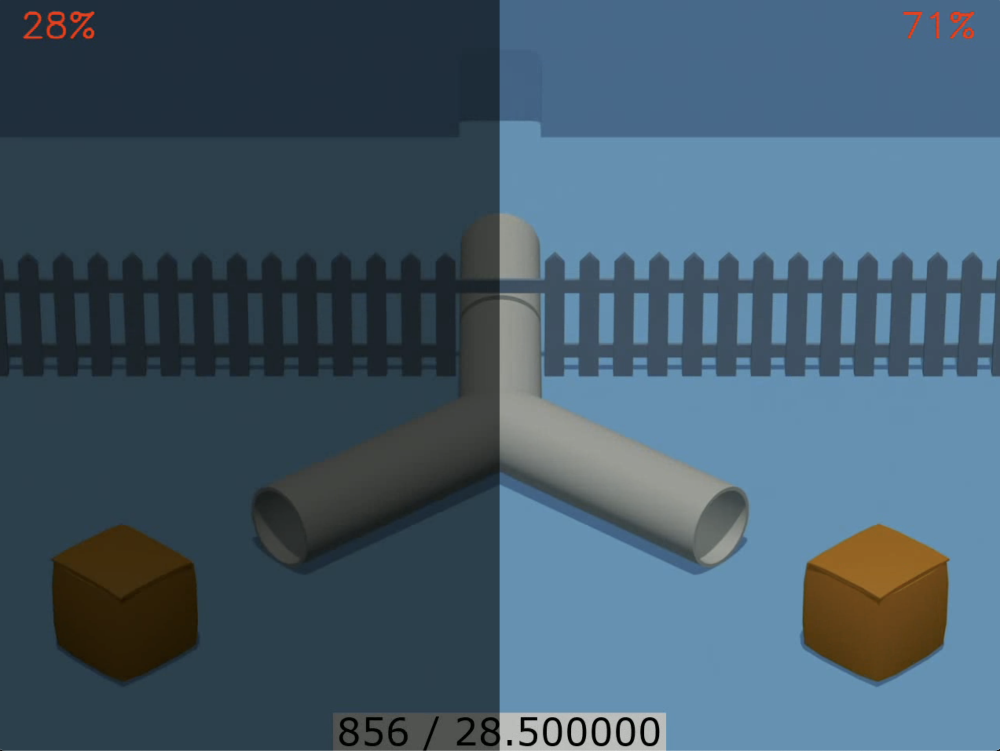

```{r installation of core dependencies, include=FALSE}

if(!"tinytex" %in% rownames(installed.packages())){
  install.packages("tinytex")
  tinytex::install_tinytex()
}

if(!"devtools" %in% rownames(installed.packages())) install.packages("devtools")
if(!"papaja" %in% rownames(installed.packages())) devtools::install_github("crsh/papaja@devel")


```

```{r setup, include = FALSE}
library("papaja")

# install these if needed
library(tidyverse)
library(psych)
library(effsize)
library(effects)

library(Rfast)
```

```{r analysis-preferences}
# Seed for random number generation
set.seed(42)
knitr::opts_chunk$set(cache.extra = knitr::rand_seed)
```


\newpage

# Introduction


Analyzing infants' gazes has been a key methodology in the toolbox of developmental researchers. For experiments that require a low granularity of gaze predictions (e.g., differentiation of left vs. right looks), manually coding gazes in video frames has been found to be a reliable measurement procedure [e.g., @fernaldLookingListeningUsing2008]. For experiments requiring more fine-grained measures of infants' looks, researchers have been using specialized eye-tracking hardware to measure coordinate-level gaze locations on computer screens [see @venkerOpenConversationUsing2015 for an overview].
Both of these methods have downsides, however: manual gaze coding is labor-intensive and requires comprehensive training [@venkerOpenConversationUsing2015], while dedicated eye-tracking hardware is expensive and restricts testing to the lab setting. An alternative approach is to use the webcams built into many modern devices to automatically infer gazes with computer vision algorithms. In recent years, such automated webcam-based gaze coding methods have been created for both adults [@papoutsakiWebGazerScalableWebcam2016; @valliappanAcceleratingEyeMovement2020] and young children [@werchanOWLETAutomatedOpensource2022; @erelICatcherRobustAutomated2022a]. While these tools are promising developments, they have yet to be independently validated for commonly used paradigms in infant research. Validating these tools is an important step in establishing them in developmental research, as it demonstrates their introduced tradeoffs and informs researchers on how to best utilize webcam-based technologies in their experiments. Validation attempts may also highlight possible shortcomings of these methods that need to be addressed in further research.
Once the properties of these systems are better understood, they will make a promising addition to the methodological toolbox of developmental science, enabling researchers to reach larger and more diverse samples in resource-effective ways.
This thesis explores the current state of webcam-based gaze coding for infant studies by classifying different approaches, validating currently available open-source tools in an empirical study, and highlighting important future research areas.

A note on the terminology used: For lack of unified terms, we call all acts of inferring gaze locations or directions of any granularity "gaze coding". For the special case in which automatic systems infer x/y coordinates on a screen, we use the term "eye-tracking". For the special case in which the looking directions "left" and "right" are differentiated (manual or automatic), we use the term "binary gaze coding".

A note on commercial webcam-based gaze coding platforms: In recent years, several commercial online platforms have been introduced that offer webcam-based eye-tracking [e.g., @goekeLabVancedUnifiedJavaScript2017]. While they aim to provide a better user experience than freely available open-source tools, they also come with considerable costs and do not publicize their eye-tracking algorithms. Considering these downsides, we have decided to narrow the scope of this thesis to free open-source tools.


# Theoretical Background


## The Case for Webcam-Based Gaze Coding

Two kinds of gaze coding methods are common in infant research: Manual coding of gazes by human raters and eye-tracking using specialized hardware. Under certain circumstances, webcam-based technologies can be preferable to both of these methods.

The advantages webcam-based gaze coding brings over manual coding by human raters are evident: If the accuracy of an automated webcam-based system is comparable to the accuracy of human raters [c.f. @erelICatcherRobustAutomated2022a], the system will lead to a reduction in coding time and more objective results.

The case for choosing webcam-based technologies over specialized eye-tracking hardware is more nuanced, as dedicated hardware provides a substantially higher spatial and temporal resolution on gaze inference: The webcam-based eye-tracker that reported the best spatial accuracy for infants features an x/y deviation of 3.36°/2.67° [@werchanOWLETAutomatedOpensource2022]. In contrast, @dalrympleExaminationRecordingAccuracy2018 found commercial eye-trackers to have an average deviation of 1.31° in a toddler sample. Additionally, specialized eye-tracking hardware provides high temporal resolutions with sampling rates of up to 500 Hz, while common webcams only support sampling rates of 30 Hz.
However, specialized eye-tracking systems are expensive and require participants to visit a laboratory for testing. As webcam-based eye-trackers are cheaper to operate and allow for remote testing, they gain multiple advantages over in-lab eye-tracking: (1) As testing can be performed remotely using devices present in a participant's home, parents can schedule testing flexibly, which makes the recruitment of larger sample sizes easier. (2) Webcam-based eye-tracking could enable unsupervised testing using platforms like Lookit [@scottLookitPartNew2017a] or Amazon Mechanical Turk, further increasing potential sample sizes. (3) Using webcam-based eye-tracking can increase the demographic diversity of samples collected in experiments. Performing studies in person not only restricts researchers to the population that can feasibly reach the lab but also to families that can afford to take the time out of their day to participate in in-person testing. The high cost of specialized hardware further restricts testing to labs with a sizable budget, favoring samples from richer countries with more established funding organizations. Webcam-based remote eye-trackers would help researchers to more easily reach populations worldwide and enable all labs to participate in data collection. (4) Webcam-based eye-trackers facilitate international collaboration among research groups, as they can be adapted by all labs participating in data collection for little cost. (5) As children can be tested at home in a familiar environment, they are more relaxed, potentially heightening their focus on experimental tasks.
Considering these advantages, webcam-based eye-trackers could be a viable alternative when conducting research with infants, given the experimental paradigm can tolerate the accuracy tradeoffs.


## Eye-Tracking vs. Binary Gaze Coding

Webcam-based gaze coding systems can be differentiated by the granularity of their output measure. Binary gaze coding determines whether a gaze is directed at the left or the right of the screen. Due to the simplicity of this measure, it can be performed manually by human coders and has been used extensively in research involving young children. Automated solutions for binary gaze coding in infants have been created [@erelICatcherRobustAutomated2022a], which lower labeling time and improve the objectivity of the labels compared to human coders. In contrast, eye-tracking systems try to estimate the exact x/y screen coordinates of a gaze. Due to the large value range that the coordinate output provides, human coders cannot perform the tracking, making the usage of computer algorithms a necessity. Most of these algorithms require a calibration procedure during initialization to account for the many variables affecting eye-to-coordinate mapping (e.g., eye shape, distance to the camera). These calibration procedures present a greater challenge for infant research, as young children are not as easily instructed to focus on presented calibration points [c.f. @werchanOWLETAutomatedOpensource2022]. Under optimal circumstances, however, the resulting x/y coordinates enable fine-grained measurements of infants looking behavior that binary coding cannot achieve.

## Real-Time vs. Post-Hoc Webcam Gaze Coding

Webcam-based gaze coding systems can also be differentiated by the point in time at which gaze inference occurs. Real-time gaze coding (also called "online") happens concurrently in the background on the participant's device while the gazes are recorded. Post-hoc gaze coding (also called "offline") occurs on the researchers' device after the recording has concluded and the video footage has been transmitted. 
Both approaches have their advantages and tradeoffs that inform the design of new gaze coding systems and need to be considered when surveying technologies for infant-based studies:

Real-time gaze coding produces predictions as the experiment runs, enabling experiment designs that react to the participants' gaze in real-time. In the case of eye-tracking, calibration data is also evaluated at the time of the experiment, so if the software deems the quality of the calibration to be insufficient, it can trigger recalibrations to enable higher tracking accuracy. Furthermore, as these technologies export already coded gaze data, data processing includes one less step than post-hoc gaze coding. Most important, however, is the privacy advantage that real-time gaze coding provides. If participant footage does not need to be checked for exclusions after the experiment concludes, the participant's webcam footage does not need to leave the participant's device at all. By not requiring the footage to be stored on a separate server, this approach removes many privacy concerns when dealing with infant video recordings.

In contrast, post-hoc gaze coding runs fully independent of the participant's available hardware, resulting in a more consistent coding performance across the sample. This device independence also enables researchers to collect comparable data across different device types like laptops, tablets, and smartphones, as it alleviates problems like performance differences and varying compatibility for real-time gaze coding software [c.f. @werchanOWLETAutomatedOpensource2022]. Not running the gaze coding on the participant's devices during testing also reduces software crashes caused by malfunctions in the gaze coding software, reducing the overall data loss from this source. Furthermore, tweaks to the gaze coding process can be made after data collection to optimize the coding process for participant-specific properties (e.g., adjusting video brightness). Most importantly, post-hoc gaze coders can use slower and more accurate gaze prediction models, as the models are not required to produce gaze inferences at high sampling rates to enable real-time feedback. Because the accuracy of webcam-based technologies is inherently lower than specialized hardware eye-trackers, this advantage is vital as slower but more sophisticated prediction models can narrow that gap.

An alternative gaze coding approach would be to perform post-hoc processing on the participant's device. This combination enables researchers to use slower and more accurate models while keeping the privacy advantages of real-time gaze coding. We are not aware of any existing infant-focused webcam-based gaze coders implementing this approach.

## WebGazer 

@papoutsakiWebGazerScalableWebcam2016 presented WebGazer, a browser-based real-time eye-tracking software that infers a person's gaze location based on their live webcam feed. WebGazer uses computer vision algorithms to detect face and eye regions and then uses eye and pupil features to infer gaze locations. 
To learn the relationship between these features and the x/y screen coordinates, it relies on the generation of training data it captures using calibration points. When a calibration point is presented, WebGazer assumes that the person is looking at the point's position and samples the eye features at that moment. It then combines the measures acquired across multiple calibration points and fits a ridge regression model - with the numeric representation of the eye's features being considered the independent variable and the x/y coordinates of the gaze point being considered the dependent variable. This model is then used to calculate x/y coordinates for new frames by predicting the coordinates based on newly captured eye and pupil features. By doing so, WebGazer achieves an average viewing angle uncertainty of 4.17° in an adult sample using its best inference model variant.
Originally, the authors designed their software to use mouse click locations as calibration points to continuously perform calibration and improve tracking performance as a user was browsing a website. However, a more traditional calibration sequence can be used when using WebGazer as a plugin for jsPsych [@deleeuwJsPsychJavaScriptLibrary2015], where multiple points are displayed for a short duration each. While this kind of calibration is more suitable for infants than measuring mouse clicks, the tracking quality still heavily depends on an infant's ability to focus on the calibration points. Furthermore, considering that WebGazer was designed for use with adults and was only evaluated on an adult sample [@papoutsakiWebGazerScalableWebcam2016], it was previously unclear if WebGazer is viable for infant research. Thus, Steffan, Zimmer, et al. (2023) collected data to validate WebGazer for an infant-focused paradigm. We discuss this study in the empirical part of this thesis. 

## iCatcher+
 
@erelICatcherRobustAutomated2022a presented iCatcher+, a post-hoc binary gaze coder designed to work with infant video footage. Given footage of an infant as input, it labels each frame with a looking direction (either "left" or "right") or "away" in case the child is not looking toward the camera. iCatcher+ works without prior calibration: It utilizes a pre-trained deep neural network trained on human-annotated data to predict the gaze location of previously unseen video frames. This architecture leads to considerable coding accuracy: When evaluating iCatcher+ across three human-labeled datasets, @erelICatcherRobustAutomated2022a found it to approach near human-level coding performance, making it the state-of-the-art automated binary gaze coding technology for infants. In the empirical part of this thesis, we evaluate iCatcher+ on a typical infant-focused looking paradigm for infants to further assess its potential for use in real-world experiments.


# Hypotheses

Steffan, Zimmer, et al. (2023) collected data in a remote setting to validate the webcam eye-tracker WebGazer for infants in an anticipatory-looking paradigm. They evaluated webcam-based technology by comparing its results to those of an in-lab sample tested by Schuwerk, Kampis, et al. (2022) measured with commercial eye-tracking systems. The authors tested whether the data gathered using WebGazer would indicate that the children engaged in spontaneous goal-based action predictions, as the participants in the in-lab study did. They replicated the in-lab findings in the remote sample, validating the use of WebGazer in remote infant studies featuring anticipatory-looking paradigms. However, they also found a significantly higher exclusion rate in the remote sample and significantly lower mean values on their main measure, highlighting possible limitations of webcam-based eye-tracking.

In this study, we expand on the findings presented in Steffan, Zimmer, et al. (2023) by taking a subset of the participants and reanalyzing their video data with an additional automated gaze-coding approach: iCatcher+. The goal was (1) to determine if iCatcher+ could replicate the findings from the original work and (2) to see how its performance compares to WebGazer and the in-lab data. As our sample was a subset of the sample used in the original study, we also analyzed the WebGazer output for those participants once more to enable a more direct comparison to iCatcher+. This approach created three data sets for gaze-coding methods spanning two participant samples: (A) The in-lab sample collected using commercial eye-tracking systems. (B) A subset of the remote sample analyzed in real-time with WebGazer. (C) The same subset of the remote sample analyzed post-hoc with iCatcher+.

Our hypotheses were as follows: (1) We expected to replicate the results collected with traditional eye-tracking systems by Schuwerk, Kampis, et al. (2022) in our subset of the remote sample using both WebGazer and iCatcher+. More specifically, we expected that the data produced by these technologies in a remote setting would indicate that 18- to 27-month-old children engage in goal-based action prediction, operationalized as above-chance looking toward a location that matches the outcome of an agent's action goal (i.e., finding the hiding agent). 
(2) We expected that there would be a significant difference in the measured looking biases when comparing the in-lab sample to the remote sample (for both webcam coders) but did not specify a directional hypothesis. Both directions were plausible: Higher noise in the webcam-based gaze coding methods could make it harder to detect looking biases present during testing compared to commercial eye-tracking hardware. Alternatively, children's focus on the task could be heightened at home due to a familiar environment, the increased scheduling flexibility to possibly test children at their most attentive, and the lack of a tiring trip to the lab, resulting in a clearer looking bias. When comparing the data of the two webcam-based gaze coders from the same subset, we did not expect a significant difference in the measured anticipatory looking behavior.
(3) Following the findings presented by Steffan, Zimmer, et al. (2023), we expected the proportion of excluded children to be higher in the remote sample (for both webcam coders) compared to the in-lab study. While the data processing steps performed for iCatcher+ and WebGazer differed in their exclusion criteria, we did not expect a significant difference in the absolute number of exclusions between the two methods.


By evaluating these hypotheses, we aim to validate iCatcher+ as a tool for measuring anticipatory-looking paradigms in a remote setting and provide a high-level comparison of its performance to that of WebGazer.

# Methods

As we have discussed, this study expands on the work done by Steffan, Zimmer, et al. (2023) by taking additional measures on a subset of the tested participants and comparing it to the original measures as well as a separate in-lab sample collected by Schuwerk, Kampis, et al. (2022). Therefore, the present study's methods description significantly overlaps with the original work. If a section is mostly similar to the contents from the original publication, this is highlighted in the respective first paragraph.

The original experiment's data collection software is openly available on GitHub ([https://github.com/adriansteffan/manywebcams-eyetracking](https://github.com/adriansteffan/manywebcams-eyetracking)). Additionally, we released the software that performs the current study's preprocessing steps, the intermediate data files, and the analysis scripts in a separate GitHub repository ([https://github.com/adriansteffan/psychology-thesis](https://github.com/adriansteffan/psychology-thesis)).

The approval of the LMU ethics board was acquired prior to testing. 
The procedure for data collection was also recorded in a pre-registration for the original publication, which can be found on OSF ([https://osf.io/p3f67/](https://osf.io/p3f67/))

```{r read in data, , results='hide', message=FALSE, warning=FALSE, include=FALSE}

# This code was moved up so that that we could report the characteristics of the included sample - maybe some cleanup could redistribute the code to better match the sections

# Read in data
DATA_DIR <- file.path("data")

inlab <- read.csv(file.path(DATA_DIR, 'inlab_data.csv'), stringsAsFactors = TRUE)

general_exclusions <- read.csv(file.path(DATA_DIR, '_exclusions_general.csv')) %>% mutate(id = str_remove(id, "_B"),
                                                                                              id = str_remove(id, "_A"))
webgazer <- read.csv(file.path(DATA_DIR, 'webgazer_data.csv'))
webgazer_resampled <- read.csv(file.path(DATA_DIR, 'webgazer_RESAMPLED_data.csv'))
webgazer_validate <- read.csv(file.path(DATA_DIR, 'webgazer_validation.csv'))
webgazer_exclusions <- read.csv(file.path(DATA_DIR, 'exclusions_webgazer.csv')) %>% mutate(id = str_remove(id, "_B"),
                                                                                                id = str_remove(id, "_A"))

icatcher <- read.csv(file.path(DATA_DIR, 'icatcher_data.csv'))
icatcher_resampled <- read.csv(file.path(DATA_DIR, 'icatcher_RESAMPLED_data.csv'))
icatcher_exclusions <- read.csv(file.path(DATA_DIR, 'exclusions_icatcher.csv')) %>% mutate(id = str_remove(id, "_B"),
                                                                                                id = str_remove(id, "_A"))

icatcher_validate <- icatcher %>% filter(stimulus == 'calibration')
icatcher_data <- icatcher %>% filter(stimulus != 'calibration')
icatcher_data_resampled <- icatcher_resampled %>% filter(stimulus != 'calibration')

demographic_data <- read.csv(file.path(DATA_DIR, 'demographic_data.csv'), stringsAsFactors = F)

# Check if the participants missing from the demo file were excluded anyway
stopifnot(
  nrow(
    general_exclusions %>%
      full_join(demographic_data 
            %>% rename(id=subid)
            ) %>% 
      filter(is.na(lab) & excluded =='i')
    ) == 0)

```

```{r preprocess, results='hide', message=FALSE, warning=FALSE, include=FALSE}

# Preprocessing

CRITICAL_TIMEFRAME_START_MS <- 25900
CRITICAL_TIMEFRAME_DURATION_MS <- 4000

exctract_lookingscore_per_timepoint = function(resampled_data){
  return(resampled_data %>%
    group_by(t) %>% 
    summarize(lookingscore = sum(grepl("target", hit, fixed = TRUE), na.rm = TRUE) / sum(grepl("target", hit, fixed = TRUE) | grepl( "distractor", hit, fixed = TRUE)))
  )
}

exctract_lookingscore_critical = function(data){
  
  ls_by_trial <- data %>%
    filter(CRITICAL_TIMEFRAME_START_MS <= t & t <= CRITICAL_TIMEFRAME_START_MS + CRITICAL_TIMEFRAME_DURATION_MS) %>%
    group_by(id, stimulus)%>%
    summarize(lookingscore = sum(grepl("target", hit, fixed = TRUE), na.rm = TRUE) / sum(grepl("target", hit, fixed = TRUE) | grepl( "distractor", hit, fixed = TRUE)),
              trial = first(trial))
  
  ls_by_part <- ls_by_trial %>% 
    group_by(id) %>%
    summarize(lookingscore = mean(lookingscore))
  
  return(list("by_trial" = ls_by_trial, "by_participant" = ls_by_part))
}

webgazer_aoi <- webgazer %>% mutate(hit=aoi_hit)
webgazer_side <- webgazer %>% mutate(hit=side_hit)

webgazer_aoi_resampled <- webgazer_resampled %>% mutate(hit=aoi_hit)
webgazer_side_resampled <- webgazer_resampled %>% mutate(hit=side_hit)

webgazer_aoi_ls_crit <- exctract_lookingscore_critical(webgazer_aoi)
webgazer_side_ls_crit <- exctract_lookingscore_critical(webgazer_side)

icatcher_ls_crit <- exctract_lookingscore_critical(icatcher_data)

# because some labs used exactly the same id
inlab$id <- paste0(inlab$subid, "_", inlab$lab)

inlab_test <- inlab %>%
  filter(experiment_num=="pilot_1a" & t >= -4000 & t <= 0) %>%
  mutate(stimulus = substr(stimulus, 1, 6))
  
inlab_ls_by_trial <- inlab %>%
  filter(experiment_num=="pilot_1a" & t >= -4000 & t <= 0) %>%
  mutate(stimulus = substr(stimulus, 1, 6)) %>%
  group_by(id, stimulus) %>%
  summarize(lookingscore = sum(grepl("target", aoi, fixed = TRUE), na.rm = TRUE) / sum(grepl("target", aoi, fixed = TRUE) | grepl( "distractor", aoi, fixed = TRUE)),
            trial = first(trial_num) 
  ) %>%
  ungroup() %>% 
  na.omit() #%>% 
#mutate(lookingscore = round(lookingscore, digits=2))

inlab_ls_by_participant <- inlab_ls_by_trial %>% 
  group_by(id) %>%
  summarize(lookingscore = mean(lookingscore))


inlab_ls_by_trial$method <- "inlab"
webgazer_aoi_ls_crit$by_trial$method <- "webgazer_aoi"
icatcher_ls_crit$by_trial$method <- "icatcher"

full_data <- inlab_ls_by_trial %>% rbind(webgazer_aoi_ls_crit$by_trial) %>% rbind(icatcher_ls_crit$by_trial)

full_data_by_participant <- full_data %>% group_by(id, method) %>% summarise(lookingscore = mean(lookingscore))

data <- full_data_by_participant %>%
  mutate(method = factor(method, levels = c("webgazer_aoi", "icatcher", "inlab")))

```


```{r exclusion reporting, warning=FALSE, include=FALSE}

# NOTE: These values were only transfered to the manuscript while writing and are not computet in-line. To make this thesis fully reproducible, replace the values with the corresponsing computations.

# Exclusion Reporting

apply_exclusion_reason = function(df, reason){
  next_df <- df %>% filter(exclusion_reason != reason)
  print(sprintf("Excluded Trials due to %s: %i", reason, nrow(df)-nrow(next_df)))
  participant_diff = length(unique(df$id)) - length(unique(next_df$id))
  if(participant_diff > 0){
    print(sprintf("Exclusion due to %s leads to: %i participants having no more remaining trials", reason, participant_diff))
  }
  return(next_df)
}

apply_exclusions_for_tracker = function(name, df, reasons){
  exclusions_trials <- df %>% filter(stimulus != 'validation1' & stimulus != 'validation2' & stimulus != 'calibration')
  print(sprintf("%s EXCLUSIONS:", name))
  for(reason in reasons){
    exclusions_trials <- apply_exclusion_reason(exclusions_trials, reason)
  }
  print(sprintf("Remaining participants for %s: %i", name, length(unique(exclusions_trials$id))))
  print(sprintf("Remaining trials for %s: %i", name, nrow(exclusions_trials)))
  print('------')
  return(exclusions_trials)
}

# Total number of participants
(total_participants_n <- length(unique(general_exclusions$id)))
(total_trials_n <- total_participants_n * 4)
DIGITS = 4 # (+2 for percent)

included_general <- apply_exclusions_for_tracker('GENERAL',general_exclusions,c('all_age', 'all_preterm', 'all_nonormalseeing', 'all_experimentererror', 'all_nodata', 'nodata', 'unattentive'))
included_webgazer <- apply_exclusions_for_tracker('WEBGAZER',webgazer_exclusions,c('_low_sampling_wg', '_no_tracker_data', 'parentgaze_wg', 'tracking_wg'))
included_icatcher <- apply_exclusions_for_tracker('ICATCHER',icatcher_exclusions,c('wrongwebcam_ic', 'noface_ic'))

(general_participants_n <- length(unique(included_general$id)))
round(general_participants_n/total_participants_n, digits = DIGITS)
(webgazer_participants_n <- length(unique(included_webgazer$id)))
round(webgazer_participants_n/total_participants_n, digits = DIGITS)

(icatcher_participants_n <- length(unique(included_icatcher$id)))
round(icatcher_participants_n/total_participants_n, digits = DIGITS)


(general_trials_n <- nrow(included_general))
round(general_trials_n/total_trials_n, digits = DIGITS)
(webgazer_trials_n <- nrow(included_webgazer))
round(webgazer_trials_n/total_trials_n, digits = DIGITS)
(icatcher_trials_n <- nrow(included_icatcher))
round(icatcher_trials_n/total_trials_n, digits = DIGITS)

(excl_general_participants_n <- total_participants_n - general_participants_n)
round(excl_general_participants_n/total_participants_n, digits = DIGITS)
(excl_webgazer_only_participants_n <- general_participants_n - webgazer_participants_n)
round(excl_webgazer_only_participants_n/total_participants_n, digits = DIGITS)
(excl_icatcher_only_participants_n <- general_participants_n - icatcher_participants_n)
round(excl_icatcher_only_participants_n/total_participants_n, digits = DIGITS)

(excl_general_trials_n <- total_trials_n - general_trials_n)
round(excl_general_trials_n/total_trials_n, digits = DIGITS)
(excl_webgazer_only_trials_n <- general_trials_n - webgazer_trials_n)
round(excl_webgazer_only_trials_n/total_trials_n, digits = DIGITS)
(excl_icatcher_only_trials_n <- general_trials_n - icatcher_trials_n)
round(excl_icatcher_only_trials_n/total_trials_n, digits = DIGITS)

```

```{r sample description for webcam data, warning=FALSE, include=FALSE}

# NOTE: These values were only transfered to the manuscript while writing and are not computet in-line. To make this thesis fully reproducible, replace the values with the corresponsing computations.

# Sample Description Webcam

report_demographic <- function (demo, name, included){
  print(sprintf('Demographic data for %s', name))
  demo <- demo %>% filter(subid %in% unique(included$id))
  
  ## age in months
  demo$age_days <- demo$age
  demo$age_months <- demo$age/30.5
  
  print(sprintf('Girls n=%i', sum(demo$participant_gender == "girl")))
  print(sprintf('Boys n=%i', sum(demo$participant_gender == "boy")))
  
  print('Residence Country')
  print(table(demo$residence_country))
  
  print('Age Range in Days')
  print(sprintf('Mean %f', mean(demo$age_days, na.rm = TRUE)))
  print(sprintf('SD %f', sd(demo$age_days, na.rm = TRUE)))
  print(summary(demo$age_days))
  
  print(sprintf('%f percent go to daycare', (100*sum(demo$daycare=='yes')/length(demo$daycare))))
  print(sprintf('for an average of %f hours per week', mean(as.numeric(demo$hours_week_daycare), na.rm = T)))
  
  # this could be cleaner, but there is no need to scale this function up to n siblings
  siblings_3 = (100*sum(!is.na(demo$sib3_age))/length(demo$sib3_age))
  siblings_2 = (100*sum(!is.na(demo$sib2_age))/length(demo$sib2_age)) - siblings_3
  siblings_1 = (100*sum(!is.na(demo$sib1_age))/length(demo$sib1_age)) - siblings_2
  print(sprintf('%f percent have no siblings', 100 - siblings_3 - siblings_2 - siblings_1))
  print(sprintf('%f percent have one sibling', siblings_1))
  print(sprintf('%f percent have two siblings', siblings_2))
  print(sprintf('%f percent have three siblings', siblings_3))
  
  # again, this could be cleaner, but there is no need to scale this function up to n languages
  languages_3 = (100*sum(!is.na(demo$lang3))/length(demo$lang3))
  languages_2 = (100*sum(!is.na(demo$lang2))/length(demo$lang2)) - languages_3
  languages_1 = (100*sum(!is.na(demo$lang1))/length(demo$lang1)) - languages_2
  print(sprintf('%f percent live with one language', languages_1))
  print(sprintf('%f percent live with two languages', languages_2))
  print(sprintf('%f percent live with three languages', languages_3))
  
  demo <- demo %>% mutate(max_parent_education = pmax(parentA_education, parentB_education, na.rm=T))
  # parent education (years and quality)
  print(sprintf('%f percent have a bachelors equivalent or better', (100*sum(demo$max_parent_education >= 16)/length(demo$max_parent_education))))
  print(sprintf('Higher educated parent went through an average of %f years of education', mean(demo$max_parent_education, na.rm=T)))
 
}

demographic_data$parentA_education <- as.numeric(demographic_data$parentA_education)
demographic_data$parentB_education <- as.numeric(demographic_data$parentB_education)

report_demographic(demographic_data, 'GENERAL', included_general)
report_demographic(demographic_data, 'WEBGAZER', included_webgazer)
report_demographic(demographic_data, 'ICATCHER', included_icatcher)

```

## Participants 
Data collection ran from January 2022 to August 2022. Participants qualified for the study if they were between 18 and 27 months old, were born full-term (>37 weeks gestation), and had no reported cognitive, visual, or hearing impairments. Testing took place remotely in the participant's home, where a caregiver accompanied them. While data collection was a multi-lab effort, the current study only includes children tested by the LMU lab. The reason for this restriction is that the present study employs measures that require access to participant webcam videos, and LMU's recordings were the only ones accessible to us. 
The LMU sample was recruited via databases provided by the city of Munich, social media postings, and university mailing lists. Five additional labs recruited children for the LMU sample using their own resources. Participants received a small picture book and a participation certificate as compensation for joining the study.
The in-lab sample had similar qualification criteria and was collected in seven labs across multiple countries. Further information on the in-lab sample can be found in Schuwerk, Kampis, et al. (2022).

The final sample that qualified for either webcam-based gaze coder comprised 61 participants aged 18-27 months (549 – 821 days, _M~age~_ = 21.38 months, _SD~age~_ = 2.35 months) contributing 235 trials (refer to the "Exclusions" part of the "Results" section for a detailed breakdown of exclusions). The sample consisted of 36 girls (59.02%) and 25 boys (40.98%). Places of residence included Germany (_n_ = 45; 73.77%), the United Kingdom (_n_ = 9; 14.75%), Austria (_n_ = 6; 9.8%), and USA (_n_ = 1; 1.6%).
For most participants (93.44%), at least one parent had attained an educational degree comparable to a bachelor's degree or higher. The parent that had achieved the higher educational degree spent 18.26 years in schooling on average. 31.15% of participants were raised bilingually, 8.20% were raised with a third language. 60.66% of participants were only-children, 36.07% had one sibling, and 3.28% had two siblings. 
Most participants were going to daycare (67.21%) and spent an average of 29.84 hours per week there.


## Sample Size Rationale

The sample size rationale for this study follows the one described by Steffan, Zimmer, et al. (2023). We based our sample size rationale on two previously shown effect sizes: The study by Schuwerk, Kampis, et al. (2022) that provides the in-lab data for comparison tested a sample of 65 toddlers and found an effect size of Cohen's _d_ = 1.03 using a one-sample t-test of the proportional looking score against chance level. 
When piloting the remote webcam-based version of the in-lab paradigm, we observed a Cohen's _d_ = 0.56 for the 20 included adults using the same one-sample t-test on looking scores. 
We predicted a significantly higher noise in our data due to the poorer accuracy of remote webcam-based eye-tracking when compared to in-lab eye-tracking [@semmelmannOnlineWebcambasedEye2018] and an increased inattentiveness and more movement artifacts in toddlers compared to adults [@dalrympleExaminationRecordingAccuracy2018]. We, therefore, chose a conservative effect size estimate of Cohen's _d_ = 0.3 for our main hypothesis. To detect this effect with a power of 0.95 and an alpha level of 0.05 in a one-sample one-tailed t-test against chance, a sample of 122 toddlers was needed.
Determining the exact number of included participants at any specific point in time during testing was challenging as multiple labs performed the original data collection in parallel. Thus, _n_ = 122 was considered the minimal sample size of included participants.

It is important to highlight that our included sample (_n_ = 61) is smaller than the minimum sample determined by the power analysis (_n_ = 122). We highlight the implications of this smaller sample size in the Discussion section.


## Material and Design

### Stimuli

The stimuli were also described in Steffan, Zimmer, et al. (2023). As they were initially used in the in-lab study to pilot the ManyBabies2 paradigm, a more detailed description can also be found in Schuwerk, Kampis, et al. (2022). Refer to files in the repository to inspect the videos fully.
The stimuli consisted of 3D animations depicting a chasing game between two agents (chaser and chasee; \autoref{fig:scene}). The scene was set in a blue-colored area featuring a fence that divided the area into an upper and lower section, taking up 1/3 and 2/3 of the height, respectively. This fence was interrupted in the middle by an inverted Y-shaped tunnel through which agents could travel from one section to the other. There was a singular tunnel exit in the upper section and two in the bottom section, symmetrically placed in the area's left and right halves. 
In front of each of these tunnel exits, a brown box with a movable lid could be found. At the start of the animation, the two agents - a brown bear (chaser) and a yellow mouse (chasee) - were positioned in the upper section of the scene.
All participants viewed the same four variations of the animation, each lasting 38 seconds. The trials started with a short game of tag between the two agents in the upper section. After the chase concluded, the agents did a high five and positioned themselves side by side in front of the tunnel entrance. The chasee entered the tunnel as the chaser watched him closely. While the chasee was not visible, footsteps could be heard to suggest movement through the tunnel. The chasee then emerged from the tunnel on either side (counterbalanced between trials) and looked back at the chaser, after which the chaser raised their hand in response. Next, the chasee jumped into the box, closed the lid, and the chaser entered the tunnel himself. Footsteps could be heard for 4000ms (referred to as the "anticipatory period"), after which the chaser exited the tunnel on the site the chasee was hiding. The chaser then knocked on the box, the chasee revealed himself, and the agents performed another high five.


```{=latex}
\begin{figure}[h!]
\caption{An overview of the scene featured in the stimulus material. At the start, both agents are positioned above the the fence. \label{fig:scene}}
```
```{r scene }

# , fig.cap = "An overview of the scene featured in the stimulus material. At the start, both agents are positioned above the the fence."
```
```{=latex}
\end{figure}
```

### Randomization
Stimuli videos were balanced by two factors: The location from which the chasee started at the beginning of the video (left L vs. right R) and the side of the box where the chasee hid (L vs. R). The four resulting stimuli were: LL - chasee started from the left and hid in the left box; LR - chasee started from the left and hid in the right box; RL - chasee started from the right and hid in the left box; RR - chasee started from the right and hid in the right box. The presentation order of these trials was counterbalanced between participants using two pseudo-randomized orders, which participants got randomly assigned to: Order A - LR, LL, RR, RL; Order B - RL, RR, LL, LR. Both the balancing measures and trial orders were identical to those presented by Schuwerk, Kampis, et al. (2022).

## Testing Procedure
The description of the testing procedure matches the one presented by Steffan, Zimmer, et al. (2023). The caregivers met up with the experimenter via a video conferencing software (e.g., Zoom). Before the experiment began, the caregiver provided informed written consent via an online survey tool. Afterward, the caregivers were asked to fill out a demographics questionnaire covering questions about linguistic and racial/ethnic background, resident country, socioeconomic status, and various characteristics of the caregiver and the family. Following that, the experimenter explained the general procedure and provided the caregiver with the following instructions: They were asked to place the child in front of their computer at a distance of approximately 40cm, either on a highchair or their caregiver's lap. Next, the experimenter guided the caretaker in establishing suitable lighting conditions for the experiment.
In case there was a source of backlight (e.g., a bright lamp or a window), the experimenter asked the caregiver to cover it or change the laptop's position so that the webcam pointed away from it.
Caregivers were also instructed to adjust the webcam's or laptop screen's angle so that the child's head was centered in the webcam's field of view. To ensure that only the child's gaze was being tracked, it was vital that only the child's eyes were visible to the webcam. Thus, the caregivers were additionally instructed to move their heads out of the webcam's vision range, close or obstruct their eyes, or look away from the screen during the procedure. Subsequently, the experimenter provided the caregiver with a personalized link to the experiment's website and reminded them to rejoin the video conference when they finished the online experiment. The caregiver then left the video conference session and opened the experiment in a browser of their choosing - Google Chrome and Firefox were recommended.
The online experiment was implemented using a modified version of jsPsych v6.3.1 [@deleeuwJsPsychJavaScriptLibrary2015]. This jsPsych version comes with an implementation of WebGazer, which was used to perform eye-tracking during the experiment.
After displaying some basic instructions, the software checked if the child's head pose satisfies the requirements of WebGazer and visually guided the caregiver to adjust the pose if necessary. For a head pose to be deemed satisfactory, both eyes must be detected within a square in the middle of the webcam feed with dimensions equal to 66% of the feed's height. In practice, this results in an accepted distance range of 40 to 130 cm (i.e., 15.7 - 51.2in).
Following this step, the eye-tracking software administered a 9-point calibration procedure, during which an attention-getter (a looping animation of a dancing bear along with an audio cue) was presented at each calibration point for 3s. The calibration points were positioned as follows (coordinates in screen percentage [width, height]): [50,50], [50,12], [12,12], [12,50], [12,88], [50,88], [88,88], [88,50], [88,12].
We assessed the quality of this calibration twice, once directly after the calibration and once after the stimulus presentation concluded. During the assessment, the attention-getter from the calibration reappeared in the center of the screen for 5s. The software then recorded the average x/y deviations of the inferred gaze point from the screen center in pixels. 
Following the first check of the calibration quality, the software played back all four stimulus videos in the participant's assigned trial order while recording their gaze locations. Additionally, webcam videos of participants were recorded throughout the calibration and for each stimulus presentation.
The experimental task took about 6 minutes. After completion, the experiment's software sent the collected data to the experimenter's server, whereafter the caregivers returned to the video conference as instructed. Here, they could report any issues they faced during testing and were given a debriefing on the purpose of the study. The entire testing procedure took approximately 20 minutes.

## Software Setup

The description of the software setup mirrors the one found in Steffan, Zimmer, et al. (2023) and additionally describes the changes made to jsPsych. 
We used a modified version of the jsPsych framework v6.3.1 [@deleeuwJsPsychJavaScriptLibrary2015] to create a website that ran the experiment. Our changes to jsPsych are as follows: First, we changed the calibration and validation procedures to support animated attention-getters and sound playback, making them more interesting to infants. Second, we modified the WebGazer extension to automatically detect hits on predefined areas of interest (AOI). Third, we added an extension to jsPsych that enabled recording the webcam feed during arbitrary tasks. 
The experiments webpage was hosted on an Apache HTTP server [@apachesoftwarefoundationApacheHTTPServer2012] running on a Ubuntu 18.04 LTS [@canonicalltd.Ubuntu18042018] virtual machine. Once the participant's caregiver accessed the website, the browser executed the experiment's code to control the stimulus presentation, record the webcam footage and perform real-time gaze inference. After the experiment concluded, the browser transmitted the data to the Apache server, where the data was saved using a PHP script [@thephpgroupPHP2020]. We took common steps to protect the participant's data, such as transmitting all data over an encrypted connection using TLS and limiting access to the hosting server to only the required lab members.

## Measures
In the experiment, we presented stimuli in which the action sequence of two agents was manipulated to measure goal-based predictions via anticipatory looking. Our primary measure of the goal-based prediction was a looking score, representing the proportion of participants' gazes towards a target and distractor during a critical time period (the 4000ms between when the chaser enters the tunnel and the chaser exits the tunnel). The target was defined as the box where the chasee hid, while the empty box served as the distractor.
We analyzed the data collected for each "participant x trial" combination with two webcam-based gaze coding technologies, receiving two separate looking scores: One for WebGazer and one for iCatcher+. We used their predictions to determine whether a gaze fell onto the target or the distractor at multiple time points of the stimulus presentation (see the following two sections for details per method). Only considering the looks that happened during the critical timeframe, we calculated a looking score for each tracker as follows: #targetlooks / (#targetlooks + #distractorlooks). This formula resulted in looking scores ranging from 0.0 to 1.0, with 0.0 indicating that the participant exclusively looked at the distractor during the critical timeframe, 1.0 indicating that the participant exclusively looked at the target, and 0.5 indicating no preference for either. We then aggregated looking scores for both gaze coders on a per-participant level by averaging the looking scores of a given participant over all of their included trials, resulting in two final looking scores per participant.
Finally, we compared these looking scores to ones generated from the data Schuwerk, Kampis, et al. (2022) collected using the same paradigm.

### WebGazer Measures

During stimulus presentation, the experiment software estimated the gaze locations in real-time, providing x/y coordinates of the estimated gaze location on the screen and a timestamp specifying how many milliseconds had passed since the start of the specific stimulus playback.
As WebGazer performs gaze inference live on the participant's device, the participant's hardware capacity dictates the maximum achievable sampling rate. Therefore, we recorded gaze points using the maximum sampling rate available to each participant and saved their sampling rate for reporting and exclusions. As we computed looking scores as a relative proportion of target looks against total looks (target + distractor), trials could be compared even at different sampling rates.
We defined two rectangular AOIs around both tunnel exits for all stimuli videos (\autoref{fig:aois}). These AOIs were significantly larger than the ones used in the in-lab study by Schuwerk, Kampis, et al. (2022).
We decided to enlargen the AOIs for our remote sample due to previously reported accuracy limitations of WebGazer: Using an adult sample, @papoutsakiWebGazerScalableWebcam2016 estimated that a gaze prediction of WebGazer has an area of uncertainty of about 100-200 pixels on a 1920x1080 screen in natural settings. 
The preprocessing software automatically labeled gazes whose x/y coordinates fell into the AOI on the tunnel exit where the chaser will reappear as "target" and gazes hitting the opposite AOI as "distractor". Gazes falling into neither AOI were tagged with "none".
While the primary analysis used the original sampling rate determined by WebGazer for each trial, the predictions were additionally resampled to 20 Hz to perform an exploratory comparison between WebGazer and iCatcher+.

In addition to outputting these measures, the preprocessing software produced a video render for each stimulus x participant combination by drawing the predicted x/y coordinate onto the stimulus for every frame and overlaying the synchronized webcam feed onto the upper left corner. We used these renders for a visual inspection to apply the WebGazer-specific exclusion criteria (see exclusion criteria below)

```{=latex}
\begin{figure}[h!]
\caption{The scene during the anticipatory period. Colored regions mark the dimension of the (counterbalanced) AOIs we used for our analyses of WebGazer data. "Target AOI" refers to the region where the chaser reappeared in accordance with their action goal. "Distractor AOI" refers to the region covering the other tunnel exit and its surroundings. (Dimensions relative to the stimulus video: Left AOI: x: 0\% - 45\%, y: 0\% - 66\%; Right AOI: x: 55\% - 100\%, y: 0\% - 66\%). \label{fig:aois}}
```
```{r aois }

```
```{=latex}
\end{figure}
```

### iCatcher+ Measures

iCatcher+ exclusively worked from the recorded webcam footage after the experiment had concluded. First, we prepared the videos for analysis by iCatcher+ by padding them to the stimulus presentation length (thereby synchronizing the webcam footage with the stimulus footage) and then converting them to the mp4 format with a fixed framerate. We chose a framerate of 20 FPS for comparability, as Steffan, Zimmer, et al. (2023) found an average sampling rate of 22Hz in their included sample for the WebGazer data. Next, the videos were analyzed using iCatcher+ with the "--use_fc_model" parameter to enable its child face detector. For every frame in the webcam video (every 50ms), iCatcher+ used its deep learning model to infer whether the child looked towards the left or the right and calculated the confidence of its prediction. iCatcher+ also created an output render for each video, overlaying every frame of the webcam footage with an indicator for the looking direction. 
Next, the preprocessing software labeled all gazes falling towards the side where the chaser would emerge as "target" and the ones falling towards the opposite side as "distractor".

In addition to outputting this measure, the preprocessing software produced a video render for each stimulus x participant combination by darkening the stimulus side that was not looked at for every frame and overlaying the iCacher+ output video onto the upper left corner. We used these renders for a visual inspection to apply the iCatcher-specific exclusion criteria (see exclusion criteria below).

## Exclusions

The exclusion criteria discussed here are based on those used by Steffan, Zimmer, et al. (2023) but were adjusted to accommodate the new preprocessing pipeline by separating general and coder-specific criteria.
While coder-specific exclusions limit the comparability between results, they maximize the available sample size for each gaze coder and allow quantifying the data loss a specific coding method entails.
Participants were globally excluded if technical problems occurred, no experiment data was transmitted, or they did not provide usable data for at least one trial. Technical issues included crashes due to insufficient available hardware resources to handle real-time gaze inference, browser freezes that halted the experiment's execution, or other technical difficulties typical for browser-based studies. Participants were also globally excluded if there was an experimenter error or it was revealed after testing that they did not meet all of the study's inclusion criteria.
We first performed a coder-agnostic manual examination of the webcam footage recorded during the stimulus presentation for the remaining participants. Trials were excluded if (1) the caregiver interfered with the procedure (talking to their child or pointing to the screen), if (2) the toddler was inattentive for more than 50% of the stimulus runtime, or if (3) the webcam feed originated from a second webcam and did not show the infant. If these rules left a participant with no more included trials, that participant was considered to be globally excluded.
Lastly, coder-specific rules were applied both automatically and through manual checking. If these rules left a participant with no more included trials, that participant was considered to be excluded for that specific gaze coder.

### WebGazer Exclusions

Trials were excluded automatically from the WebGazer data if (1) they were missing WebGazer tracking data or if (2) the sampling rate of ganze inference provided by the device was lower than 10 Hz. We justified this cut-off at 1/3rd of the maximum sampling rate of standard consumer webcams (30 Hz). Our pilot demonstrated that most participants with sampling rates lower than 10 Hz had very weak hardware, resulting in refresh rates of 1-2 Hz. Comparable studies by @yangWebcambasedOnlineEyetracking2021 used a cut-off of 5 Hz, but did not explain the reasoning behind this value.
After automatic exclusions, all renders were manually checked and excluded if (1) WebGazer tracked the caregiver's gaze or (2) the visual inspection indicated that the inferred gaze point deviated strongly from plausible locations based on the webcam footage. This mismatch could occur if the visual properties of the environment were suboptimal, the gaze point froze at a location even though the toddler kept moving their eyes, or the calibration quality was poor. Trials were also excluded for reason (2) if the footage stemmed from a different webcam than the one WebGazer was using and the plausibility was impossible to check from the viewing angle provided.

### iCatcher+ Exclusions

No automatic exclusions took place for the iCatcher+ data. The renders created for iCatcher+ were manually checked and excluded if (1) the webcam video feed did not stem from the front-facing camera (preventing iCatcher+ from inferring gaze direction) or if (2) the face detector of iCatcher+ failed to detect an infant face in the footage for more than 50% of frames.


## Statistical Analysis

We limited our statistical analyses to those that aid in comparing WebGazer, iCatcher+, and the in-lab sample. More elaborate analyses (e.g., WebGazer sampling rate, the effect of age on looking score) of the complete sample tested using the same procedure can be found in Steffan, Zimmer, et al. (2023).
We carried out all statistical analyses in  R (version 4.2.2, R Core Team, 2021). 

To test if our webcam-based gaze coder data indicates that participants anticipated the goal-directed action outcomes, we performed a one-sample t-test to test above-chance looking scores for both WebGazer and iCatcher+. Next, we tested if the looking scores differed between the in-lab and the webcam-based samples and if the looking scores differed between iCatcher+ and WebGazer. As data for the methods "iCatcher+" and "WebGazer" stemmed from the same sample while the in-lab data originated from a different one, integrating these into a singular model with "method" as a factor would introduce undesired biases. We, therefore, tested this hypothesis by performing three pairwise comparisons using t-tests on the looking scores between all three gaze-coding methods (paired t-test for WebGazer and iCatcher+, Welch two sample t-tests for in-lab and each webcam coder). Similarly, we tested the relationship between the method and the exclusion rate by performing three pairwise comparisons between the three methods' exclusion rates. We computed a Chi-square test on the 2 (method A vs. method B) x 2 (percentage included vs. percentage excluded) contingency tables for each pair.

In addition to the confirmatory analyses, we performed further analyses on the data generated from the webcam-based sample. 
First, we validated WebGazer's tracking quality by comparing the data generated during the two calibration quality assessments (right after calibration and after stimulus presentation). Although the absolute deviation values are difficult to interpret due to the missing ground truth regarding the gaze estimation, comparing the values at both assessment time points per participant can estimate the deterioration of eye-tracking quality. To compare the two validation time points for a deterioration of tracking quality, we performed a two-tailed t-test for paired samples on the mean deviation in percent for both the x and y coordinates.
Second, we validated iCatcher+ by making it compute gaze predictions on the webcam footage captured during the calibration sequence (27s). We then isolated the time points when a clear side was indicated (6s to 15s: the attention-getter was on the left half of the screen; 18s to 27s: the attention-getter was on the right half of the screen) and calculated the proportion of iCatcher+ predictions that fell into the expected side of the calibration video.
Third, we aimed to quantify the degree to which WebGazer and iCatcher+ agreed in their inferred looking directions. To make a comparison between iCatcher+ and WebGazer possible, we transformed the resampled WebGazer data by tagging data points according to the side of the screen they fell into (right: x <= 0.5 * stimulus width; left: x > 0.5 * stimulus width). We then compared the predictions from iCatcher+ with the transformed WebGazer data in three timeframes: (1) the anticipatory looking period; (2) the period starting when the chaser exits the tunnel and stopping when the video ends (3); 1 and 2 combined. Additionally, all timeframes were compared in two ways: (A) considering all time points; (B) considering only the time points in which WebGazer indicated an AOI hit. Considering both WebGazer and iCatcher+ as raters and interpreting each participant x stimulus x timepoint combination as a single rating, we computed Cohen's kappa for all 3 (timeframes) x 2 (aoi-only vs. all) = 6 conditions. Additionally, we examined the consistency of looking scores assigned to participants between the two gaze coders by calculating the intra-class correlation using a two-way mixed effect model for single rater (ICC(3,1)). 


# Results

## Anticipatory Looking Behavior

```{r, lookingscore_table}
looking_score_table <- full_data %>% group_by(method, stimulus) %>% summarise(lookingscore = mean(lookingscore)) %>% spread(key = method, value = lookingscore)
looking_score_table <- looking_score_table[-1] %>% t() %>% as.data.frame() %>% setNames(looking_score_table[,1]$stimulus)
rownames(looking_score_table) <- c("iCatcher+", "In-Lab", "WebGazer")
looking_score_table <- looking_score_table[c(1,3,2),]


apa_table(
  looking_score_table
  , caption = "An overview of the mean looking scores broken down by stimulus and gaze coding technology."
  , escape = TRUE
)
```


A descriptive overview of looking scores per gaze coder and trial can be seen in \autoref{tab:lookingscore_table}.
For WebGazer, the mean relative looking time toward the location that matched the outcome of the chaser's action goal (measured as the looking score, _M_ = `r mean(webgazer_aoi_ls_crit$by_participant$lookingscore)`, _SD_ = `r sd(webgazer_aoi_ls_crit$by_participant$lookingscore)`) was significantly higher than chance level (0.5), `r apa_print(t.test(webgazer_aoi_ls_crit$by_participant$lookingscore, mu = 0.5, alternative = "two.sided"))$full_result`, Cohen's _d_ = `r effsize::cohen.d(webgazer_aoi_ls_crit$by_participant$lookingscore,f=NA, mu = 0.5)$estimate`, indicating that the participants did anticipate the goal-directed action outcome.
Similarly, for iCatcher+, the mean relative looking time towards the target location (_M_ = `r mean(icatcher_ls_crit$by_participant$lookingscore)`, _SD_ = `r sd(icatcher_ls_crit$by_participant$lookingscore)`) was also significantly higher than chance level (0.5), `r apa_print(t.test(icatcher_ls_crit$by_participant$lookingscore, mu = 0.5, alternative = "two.sided"))$full_result`, Cohen's _d_ = `r effsize::cohen.d(icatcher_ls_crit$by_participant$lookingscore,f=NA, mu = 0.5)$estimate`, indicating that the participants did anticipate the goal-directed action outcome.
In the in-lab sample (Schuwerk, Kampis, et al., 2022), participants also exhibited above chance looking towards the target location _t_(69) = 8.80, _p_ < 0.001, leading to a mean looking score of 0.73 (_SD_ = 0.22) and an effect size of Cohen's _d_ = 0.66.

```{r visualization, results='hide', warning=FALSE, include=FALSE}

# Visualization

## plot lookingscore over time for webcam based methods

webgazer_aoi_ls_over_time <- exctract_lookingscore_per_timepoint(webgazer_aoi_resampled) %>% mutate(tracker='webgazer_aoi')
webgazer_side_ls_over_time <- exctract_lookingscore_per_timepoint(webgazer_side_resampled) %>% mutate(tracker='webgazer_side')
icatcher_ls_over_time <- exctract_lookingscore_per_timepoint(icatcher_data_resampled) %>% mutate(tracker='icatcher')

ls_over_time <- do.call("rbind", list(
  webgazer_aoi_ls_over_time,
  webgazer_side_ls_over_time, 
  icatcher_ls_over_time
)) %>% spread(key = tracker, value = lookingscore)

```

```{=latex}
\begin{figure}[h!]
\caption{A stillframe captured from a beeswarm plot visulalization of WebGazer. Each blue dot represents an infered gaze location of a participant. The red dot repersents the mean gaze coordinates of all gazes that fell onto the stimulus material. The white circle is a visualization of the current standard deviation of the displayed gazepoints. \label{fig:webgazer}}
```
```{r webgazer }

```
```{=latex}
\end{figure}
```


```{=latex}
\begin{figure}[h!]
\caption{A stillframe captured from a visualization of iCatcher+ data during the anticipatory perior of a right-targetted stimulus. In this visualization, a side was displayed brighter the higher the proportion of looks towards that direction was across the entire sample. \label{fig:icatcher}}
```
```{r icatcher }

```
```{=latex}
\end{figure}
```

```{=latex}
\begin{figure}[H]
\caption{A plot visualizing iCatchers's and WebGazer's mean looking scores across the sample (y-axis) over the video duration (x-axis). It shows that the gaze coding technology was successful in showing action-related looking: At the beginning, no clear side is indicated by the action, resulting in chance-level looking scores. Once the chasee exits the tunnel at 18 seconds, the first bias towards the target side can be seen (peak in graph). The following valley is caused by the chaser making a noise, drawing attention back to the screen's center. The second peak happens when the chasee enters the box, followed by the anticipatory period (marked by vertical lines), which shows a weaker bias towards the target. When the chaser exits the tunnel to reunite with the chasee at 31 seconds, the looking scores are maximized, as nearly all children are focused on the interaction. The horizontal line shows the chance level looking score. For WebGazer specifically, one can observe a timing delay compared to iCatcher+ as well as an artifact at t = 0 caused by this delay. \label{fig:figicatcherwebgazerls}}
```
```{r figicatcherwebgazerls }
plot(ls_over_time$t, ls_over_time$webgazer_aoi, type = "l", col="red", xlab="Time since Stimulus Video Start (ms)", ylab="Sample's Mean Looking Score", ylim = c(0.0, 1.0))
lines(ls_over_time$t, ls_over_time$icatcher,col="green")
abline(v=26000, col="blue")
abline(v=30000, col="blue")
abline(h=0.5, col="blue")
legend(2000, 0.9, legend=c("iCatcher+", "WebGazer"),
       col=c("green", "red"), lty=1:1, cex=0.8)
```
```{=latex}
\end{figure}
```


```{r wobblycode}
## Plot difference in lookinscore between methods 


errorbars <- data %>% group_by(method) %>%
  summarise(mean = mean(lookingscore), se = 1.96*sd(lookingscore)/sqrt(n()), upper = mean + se, lower = mean - se)

# plot the data
H2.plot <- ggplot(data, aes(x = method, y = lookingscore, colour = method, fill = method)) +
  geom_violin(alpha = 0.5, width = 1, position = position_dodge(width = 0.9), show.legend = FALSE ) +
  geom_jitter(aes(colour = method),  size = 2, alpha = 0.6, position = position_jitterdodge(jitter.width = 0.2, jitter.height = 0, dodge.width = 0.9), show.legend = FALSE) +
  geom_point(aes(x = method, y = mean), errorbars, inherit.aes = FALSE, size = 2, color = "black") +
  geom_errorbar(aes(x = method, ymax = upper, ymin = lower), errorbars, inherit.aes = FALSE,
                stat = "identity", width = 0.05, color = "black") +
  ylim(0, 1) +
  scale_colour_manual(values=c("skyblue", "red", "green"))  +
  scale_fill_manual(values=c("skyblue",  "red", "green")) +
  geom_hline(yintercept=0.5, linetype="dashed", color = "black") +
  labs(title="Proportional Looking Score per method (95% CIs)", x="Method", y="Proportion Looking Score (target/target+distractor)") +
  scale_x_discrete(labels = c('WebGazer','iCatcher+','In-Lab')) +
  theme_classic()

```

```{=latex}
\begin{figure}[H]
\caption{A plot depicting the proportional looking score (looking time to target AOI/looking time to target + distractor AOI) (y Axis) per gaze coding method, WebGazer, iCatcher+, and in-lab (x Axis). The error bars represent the 95\% confidence intervals. \label{fig:wobbly}}
```
```{r wobbly }
print(H2.plot)
```
```{=latex}
\end{figure}
```


## Looking Score Difference Between Methods[^p]

```{r, include = FALSE}

paired_by_participant <- inner_join(icatcher_ls_crit$by_participant, webgazer_aoi_ls_crit$by_participant, by='id')
paired_by_trial <- inner_join(icatcher_ls_crit$by_trial, webgazer_aoi_ls_crit$by_trial, by=c('id', 'stimulus'))

delta_inlab_web <- effsize::cohen.d(inlab_ls_by_participant$lookingscore, webgazer_aoi_ls_crit$by_participant$lookingscore, paired=F)
delta_inlab_ic <- effsize::cohen.d(inlab_ls_by_participant$lookingscore, icatcher_ls_crit$by_participant$lookingscore, paired=F)
delta_ic_web <- effsize::cohen.d(paired_by_participant$lookingscore.x, paired_by_participant$lookingscore.y, paired=T)

```

The mean looking scores per coding method are visualized in \autoref{fig:wobbly} .When comparing the looking scores of the in-lab sample to the total included sample for WebGazer, there was a significant difference in favor of the in-lab sample `r apa_print(t.test(inlab_ls_by_participant$lookingscore, webgazer_aoi_ls_crit$by_participant$lookingscore, alternative = "two.sided", paired=F))$full_result` with an observed effect size of Cohen's _d_ = `r delta_inlab_web$estimate`, [`r delta_inlab_web$conf.int[1]`,`r delta_inlab_web$conf.int[2]`]. When comparing the looking scores of the in-lab sample to the total included sample for iCatcher+, we also found a significant difference in favor of the in-lab sample `r apa_print(t.test(inlab_ls_by_participant$lookingscore, icatcher_ls_crit$by_participant$lookingscore, alternative = "two.sided", paired=F))$full_result`. The estimated effect size for this difference was Cohen's _d_ = `r delta_inlab_ic$estimate`, [`r delta_inlab_ic$conf.int[1]`,`r delta_inlab_ic$conf.int[2]`]. When comparing the looking scores of WebGazer and iCatcher+ (paired - only participants included for both trackers were considered, _n_ = `r nrow(paired_by_participant)`), no significant difference was found `r apa_print(t.test(paired_by_participant$lookingscore.x, paired_by_participant$lookingscore.y, alternative = "two.sided", paired=T))$full_result`, Cohen's _d_ = `r delta_ic_web$estimate`, [`r delta_ic_web$conf.int[1]`,`r delta_ic_web$conf.int[2]`].


[^p]: Due to the non-orthogonal combination of dependent and independent samples across methods (icatcher and webgazer both stem from the same sample, the in-lab data comes from a second sample), it was not possible to compute all 3 methods in a single model. Thus, multiple pairwise comparisons were performed using separate t-tests.


## Exclusions

LMU tested a total of 86 participants in the remote setting.
From these, we excluded 4 for being outside the allowed age range, 2 for being born prematurely, 1 for having no normal eyesight, 1 for experimenter error, and 15 for providing no data due to technical difficulties. On a trial level, we excluded 1 trial for missing data, and a further 16 after our manual inspection found the participant to be inattentive for more than 50% of stimulus presentation. These trial exclusions resulted in 2 additional participants being excluded, as they provided no more usable trial data.
In total, 109 trials (31.69%) and 25 participants (29.07%) were globally excluded from the remote sample. 
For the in-lab sample, 8 out of 78 tested participants (10%) were excluded due to problems with data collection (_n_ = 2) or early termination of the experiment (_n_ = 6; Schuwerk, Kampis, et al., 2022)

### Webgazer Exclusions

From the globally included remote sample, we excluded 3 trials due to missing WebGazer tracking data (technical difficulties), leading to 1 participant being fully excluded. A further 30 trials were automatically excluded for exhibiting a sampling rate < 10 Hz, leading to 7 more participants being excluded from the analysis.
During visual inspection, we excluded 2 participants, along with their 8 trials, as WebGazer was tracking the parent's gaze.
A further 33 trials were excluded during visual inspection for exhibiting poor tracking quality, leading to 3 participants being fully excluded.
For the WebGazer sample, 13 participants (15.12%) and 74 trials (21.51%) were excluded in addition to the global exclusion, leaving an included sample of 48 participants (55.81%) and 161 trials (46.80%).

### iCatcher+ Exclusions
From the globally included remote sample, we excluded 2 participants and 8 trials due to the wrong webcam being recorded during stimulus playback.
During visual inspection, we excluded a further 7 trials, as no face was detected for at least 50% of the stimulus presentation, leading to 1 more participant being fully excluded.
For the iCatcher+ sample, 3 participants (3.49%) and 15 trials (4.36%) were excluded in addition to the global exclusions, leaving an included sample of 58 participants (67.44%) and 220 trials (63.95%).

### Exclusion Analysis

```{r, include = FALSE}
# Exclusion analysis

generate_exclusion_table <- function(name_a, included_a,  excluded_a, name_b, included_b, excluded_b){
  exclusion_table <- matrix(c(included_a, included_b, excluded_a, excluded_b), nrow = 2, ncol = 2, byrow = T)
  rownames(exclusion_table) <- c('included', 'excluded')
  colnames(exclusion_table) <- c(name_a, name_b)
  exclusion_table
}

total_participatns_webcam <- length(unique(general_exclusions$id))

included_webgazer_n <- nrow(webgazer_aoi_ls_crit$by_participant)
included_icatcher_n <- nrow(icatcher_ls_crit$by_participant)
included_inlab_n <- nrow(inlab_ls_by_participant)

excluded_webgazer_n <- total_participatns_webcam - included_webgazer_n
excluded_icatcher_n <- total_participatns_webcam - included_icatcher_n
excluded_inlab_n <- 8 # hardcoded as that information was not available in the data. REPLACE THIS IN CASE OF REPLICATION 

exclusion_table_w_ic <- generate_exclusion_table('webgazer', included_webgazer_n, excluded_webgazer_n, 'icatcher', included_icatcher_n, excluded_icatcher_n)
exclusion_table_w_in <- generate_exclusion_table('webgazer', included_webgazer_n, excluded_webgazer_n, 'inlab', included_inlab_n, excluded_inlab_n)
exclusion_table_ic_in <- generate_exclusion_table('icatcher', included_icatcher_n, excluded_icatcher_n, 'inlab', included_inlab_n, excluded_inlab_n)

# test webgazer vs icatcher exclusion on trial level
nrow(included_general)

total_trials_webcam <- total_participatns_webcam * 4
included_trials_webgazer_n <- nrow(webgazer_aoi_ls_crit$by_trial)
included_trials_icatcher_n <- nrow(icatcher_ls_crit$by_trial)

excluded_trials_webgazer_n <- total_trials_webcam - included_trials_webgazer_n
excluded_trials_icatcher_n <- total_trials_webcam - included_trials_icatcher_n

exclusion_table_w_ic_trial <-  generate_exclusion_table('icatcher trials', included_trials_icatcher_n, excluded_trials_icatcher_n, 'webgazer trials', included_trials_webgazer_n, excluded_trials_webgazer_n)

h_w_in <- chisq.test(exclusion_table_w_in)
h_w_in$sample.size <- sum(exclusion_table_w_in)
h_ic_in <- chisq.test(exclusion_table_ic_in)
h_ic_in$sample.size <- sum(exclusion_table_ic_in)
h_w_ic <- chisq.test(exclusion_table_w_ic)
h_w_ic$sample.size <- sum(exclusion_table_w_ic)
h_w_ic_trial <- chisq.test(exclusion_table_w_ic_trial)
h_w_ic_trial$sample.size <- sum(exclusion_table_w_ic_trial)
```


When comparing the exclusion rates of WebGazer and the in-lab sample, we found a statistically significant difference in favor of the in-lab sample, `r apa_print(h_w_in)$full_result[1]`, meaning the in-lab sample showed significantly fewer exclusions. 
When comparing the exclusion rates of iCatcher+ and the in-lab sample, we also found a statistically significant difference in favor of the in-lab sample, `r apa_print(h_ic_in)$full_result[1]`, meaning the in-lab sample showed significantly fewer exclusions.
No significant difference was found when comparing the participant-level exclusion rates of WebGazer and iCatcher+: `r apa_print(h_w_ic)$full_result[1]`. However, when comparing the exclusion rates of WebGazer and iCatcher on a trial level, we found that WebGazer had a significantly higher trial exclusion rate compared to iCatcher+ `r apa_print(h_w_ic_trial)$full_result[1]`. Refer to \autoref{tab:trial_freq} for an overview of included trials per technology.

```{r, trial_freq}

# Descriptive Statistics

## Included Trials
trial_table <- data.frame(table(icatcher_ls_crit$by_trial$stimulus)) %>% 
  rename("iCatcher+" = Freq) %>% 
  inner_join(
    data.frame(table(webgazer_aoi_ls_crit$by_trial$stimulus)),
    by=c("Var1")
    ) %>% 
  rename("WebGazer" = Freq) %>%
  inner_join(
    data.frame(table(inlab_ls_by_trial$stimulus)),
    by=c("Var1")
  ) %>% 
  rename("In-Lab" = Freq, "Trial" = Var1)

trial_table <- trial_table[-1] %>% t() %>% as.data.frame() %>% setNames(trial_table[,1])

apa_table(
  trial_table
  , caption = "The absolute number of included trials, divided by stimulus and gaze coding technology."
  , escape = TRUE
)

```

## WebGazer Validation

```{r, include = FALSE}

deterioration <- webgazer_validate %>%  
  pivot_wider(names_from = index, values_from = -c(index, id)) %>% 
  mutate(y_det = abs(avg_offset_y_percent_1) - abs(avg_offset_y_percent_0),
         x_det = abs(avg_offset_x_percent_1) - abs(avg_offset_x_percent_0)) %>%  
  select(id, y_det, x_det)

```

All values reported are percentages relative to the screen's width and height. Across all calibration quality assessment trials of the included WebGazer sample, we found a mean deviation of _M_ = `r mean(abs(webgazer_validate$avg_offset_x_percent))`% (_SD_ = `r sd(abs(webgazer_validate$avg_offset_x_percent))`%) for x coordinates and a deviation of _M_ = `r mean(abs(webgazer_validate$avg_offset_y_percent))`% (_SD_ = `r sd(abs(webgazer_validate$avg_offset_y_percent))`%) for y coordinates. When comparing the validation time points, we found no significant deterioration in tracking quality between the two time points for either coordinate (x: `r apa_print(t.test(deterioration$x_det, mu = 0, alternative = "two.sided"))$full_result`, Cohen's _d_ = `r mean(deterioration$x_det) / sd(deterioration$x_det)`; y: `r apa_print(t.test(deterioration$y_det, mu = 0, alternative = "two.sided"))$full_result`, Cohen's _d_ = `r mean(deterioration$y_det) / sd(deterioration$y_det)`). This result indicates that the tracking quality did not deteriorate significantly during stimulus presentation.

## iCatcher+ Validation

```{r, include=FALSE}

RILAKUMA_LEFT_START <- 6500
RILAKUMA_LEFT_END <- 15150
RILAKUMA_RIGHT_START <- 18700

calibration_hits <- icatcher_validate %>% 
  mutate(rilakuma_side = ifelse(RILAKUMA_LEFT_START <= t & t <= RILAKUMA_LEFT_END,
                                'left',
                                ifelse(RILAKUMA_RIGHT_START <= t,
                                       'right', 
                                       'none')
                                )
         ) %>% 
  filter((rilakuma_side == 'left' | rilakuma_side == 'right') & (look == 'left' | look == 'right')) %>% 
  mutate(hit = ifelse(rilakuma_side == look,1,0)) %>% 
  select(id, t, look, hit)

calibration_hits_test <-  calibration_hits %>% mutate(look = ifelse('right' == look,1,0))
#calibration_hits_per_part <- calibration_hits %>% group_by(id) %>% summarize(score=mean(hit))

icatcher_bias <- icatcher_data_resampled %>% filter(look == 'left' | look == 'right') %>%  mutate(look = ifelse(look=='right', 1, 0))

left_leaning_icatcher_trials <- sum((icatcher_ls_crit$by_trial$stimulus == 'FAM_LL') | (icatcher_ls_crit$by_trial$stimulus == 'FAM_RL'))
right_leaning_icatcher_trials <- sum((icatcher_ls_crit$by_trial$stimulus == 'FAM_LR') | (icatcher_ls_crit$by_trial$stimulus == 'FAM_RR'))

```

During the analyzed parts of the calibration sequence (6s to 15s; 18s to 27s), the inferred looking side matched the side where the attention-getter was displayed `r mean(calibration_hits$hit)*100`% of the time. A one-sample t-test testing for an average bias towards either side across all analyzed time points in the calibration sequence was not significant, `r apa_print(t.test(calibration_hits_test$look, mu=0.5))$full_result`. In contrast, when considering all looks across the stimuli videos, `r mean(icatcher_bias$look)*100`% of gazes fell towards the right side of the screen, even though only `r right_leaning_icatcher_trials/(right_leaning_icatcher_trials + left_leaning_icatcher_trials)*100`% of the included trials featured right-targeted stimuli. We found this bias to be significant when using a one-sample t-test against 50% right looks `r apa_print(t.test(icatcher_bias$look, mu = 0.5, alternative = "two.sided"))$full_result`.


## Agreement Between WebGazer and iCatcher+

```{r, include=FALSE}

agreement_raw <- webgazer_resampled %>% mutate(aoi_wg = aoi, side_wg = side) %>% 
  inner_join(icatcher_data_resampled %>% mutate(side_ic = look), by=c('id','stimulus','t')) %>% 
  select(id, stimulus, t, aoi_wg, side_wg, side_ic) 

# code left and right so that they can be used for binary agreement measures
agreement_raw <- agreement_raw %>% mutate_at(vars(c('aoi_wg','side_wg','side_ic')), ~ifelse(.=='left', 1, ifelse(.=='right', 0, .)))

# exclude all timepoints where any of the trackers did not produce a value
agreement_raw[agreement_raw==''] <- NA
agreement_raw <- agreement_raw %>% na.omit()

# exclude timepoints before the critical window - icatcher only knows left vs right and there was no clearly expected side to look at
agreement_raw_after_critical_start <- agreement_raw %>% filter(CRITICAL_TIMEFRAME_START_MS <= t)

# exclude timepoints where icatcher did not decide on a side
agreement_after_critical_start <- agreement_raw_after_critical_start %>%  filter(side_ic == 1 | side_ic == 0)

# how much general agreement?

agreement_in_critical <- agreement_after_critical_start %>% filter(t <= CRITICAL_TIMEFRAME_START_MS + CRITICAL_TIMEFRAME_DURATION_MS)
agreement_after_critical_end <- agreement_after_critical_start %>% filter(t >= CRITICAL_TIMEFRAME_START_MS + CRITICAL_TIMEFRAME_DURATION_MS)

kappa_all_after_start <- psych::cohen.kappa(x=cbind(agreement_after_critical_start$side_wg,agreement_after_critical_start$side_ic))$kappa
kappa_all_in <- psych::cohen.kappa(x=cbind(agreement_in_critical$side_wg,agreement_in_critical$side_ic))$kappa
kappa_all_after_end <- psych::cohen.kappa(x=cbind(agreement_after_critical_end$side_wg,agreement_after_critical_end$side_ic))$kappa
kappa_all_after_end 

# when webgazer hit aoi, did icatcher agree?
agreement_aoi_after_critical_start <- agreement_after_critical_start %>%  filter(aoi_wg != 'none')

agreement_aoi_in_critical <- agreement_aoi_after_critical_start %>% filter(t <= CRITICAL_TIMEFRAME_START_MS + CRITICAL_TIMEFRAME_DURATION_MS)
agreement_aoi_after_critical_end <- agreement_aoi_after_critical_start %>% filter(t >= CRITICAL_TIMEFRAME_START_MS + CRITICAL_TIMEFRAME_DURATION_MS)

kappa_aoi_after_start <- psych::cohen.kappa(x=cbind(agreement_aoi_after_critical_start$side_wg,agreement_aoi_after_critical_start$side_ic))$kappa
kappa_aoi_in <- psych::cohen.kappa(x=cbind(agreement_aoi_in_critical$side_wg,agreement_aoi_in_critical$side_ic))$kappa
kappa_aoi_after_end <- psych::cohen.kappa(x=cbind(agreement_aoi_after_critical_end$side_wg,agreement_aoi_after_critical_end$side_ic))$kappa

points_considered <- c("WebGazer AOI hit", "All")
in_critical <- c(kappa_aoi_in, kappa_all_in)
after_end <- c(kappa_aoi_after_end, kappa_all_after_end)
after_start <- c(kappa_aoi_after_start, kappa_all_after_start)

kappa_table <- data.frame(points_considered, in_critical, after_end, after_start)
colnames(kappa_table) <- c("Points included", "During Critical Timeframe", "After Critical Timeframe", "During & After")

ICC_res <- (paired_by_participant %>% rename(R1 = lookingscore.x, R2 = lookingscore.y) %>% select(R1, R2) %>% psych::ICC())$results
```


The scores for Cohen's kappa can be seen in \autoref{tab:kappa_table}. The highest agreement (Cohen's _k_ = `r kappa_aoi_after_end`) could be witnessed when only considering the time after the chaser exited the tunnel and only comparing times when WebGazer hit an AOI, indicating substantial agreement. The lowest agreement (Cohen's _k_ = `r kappa_all_in`) could be seen when only the anticipatory period was considered and all time points were compared, indicating no agreement to slight agreement. The ICC(3,1) score (two-way mixed effect model for single rater) rating for participants looking scores was `r ICC_res[3,2]` (CI: [`r ICC_res[3,7]`, `r ICC_res[3,8]`]), indicating poor consistency.

```{r, kappa_table}

apa_table(
  kappa_table
  , caption = "The Cohen's kappa agreement scores between WebGazer and iCatcher+ when comparing the gaze direction the coders predicted. Values are differentiated by timeframe (during the critial period vs. after the critical period vs. from the start of the critical period to the end of the video) and the data points included (all vs. only those where WebGazer registered an AOI hit)"
  , escape = TRUE
)
```

# Discussion

This study validated the use of two open-source gaze-coding methods with infants in a remote setting for an anticipatory-looking paradigm originally designed for commercial eye-trackers in a lab environment (Schuwerk, Kampis, et. al, 2022). We analyzed a subset of the data collected by Steffan, Zimmer, et al. (2023) using both WebGazer and iCatcher+ to measure anticipatory-looking behavior and compared the results with each other and to those of an in-lab study. Both gaze coders yielded results that replicated the in-lab findings, suggesting that both technologies can be used to incorporate eye-tracking into online studies designed for infants. Both tracking performance and inclusion rate were significantly higher in the in-lab sample, while no difference between both webcam gaze coders was found. Low agreement scores between WebGazer and iCatcher+ indicate lacking reliability and suggest that further investigations are necessary. 

## Goal-Based Action Prediction

We found that 18- to 27-month-olds engage in above-chance looking towards the location that matches the outcome of an agent's action goal in our remote sample, regardless of whether we analyzed the data with WebGazer or iCatcher+. Both webcam-based methods witnessed goal-based action predictions of the participants in the remote sample, thereby replicating the findings of Schuwerk, Kampis, et al. (2022) that were obtained with commercial in-lab eye-tracking hardware. Thus, we argue that WebGazer and iCatcher+ can both be used to assess children's goal-based action predictions in a remote online setting. Also, these results are consistent with previous literature that suggested that web-based testing with children can yield comparable results to in-lab sessions [@chueyModeratedOnlineDataCollection2021; @chueyConductingDevelopmentalResearch2022; @schidelkoOnlineTestingYields2021; @preinTANGOReliableOpensource2022].

## Comparing Performance of Online vs. In-Lab Gaze Coding

Mean looking scores towards the target were significantly higher for the in-lab sample than for the online sample, regardless of whether we analyzed the data with WebGazer or iCatcher+. This difference suggests that there are limitations to remote webcam-based gaze coding. We agree with Steffan, Zimmer, et al. (2023) that this difference is likely an artifact of the reduced accuracy of webcam-based approaches compared to specialized in-lab eye-tracking hardware. However, we observed this difference across two different webcam-based gaze coders on the same sample, while the mean looking scores of these did not differ significantly from each other. Thus, we need to consider two additional causes for the lower mean looking score inherent to the sample, other than the lower tracking performance of webcam-based methods: The remote setting and cohort effects.
While we previously assumed that the familiar setting would positively affect task focus, the remote setting might have introduced additional distractors in the children's environment, lowering their ability to focus on the task and reason about the actors' goal-based actions. This reduction would have decreased the effect that we would be able to measure.
Another possibility is that the cohort generally exhibited less goal-based action prediction. Reasons for such cohort effects can be varied and are usually difficult to capture. One possible explanation for this difference could be the testing period for the webcam sample that ran from January to August 2022. Harsh restrictions due to the Covid-19 pandemic likely changed the daily life of the children in the remote sample, e.g., leading to increased screen exposure, fewer interactions with peers and other adults, and a change in caretakers' behavior due to pandemic-related stress. These changes could have possibly reduced understanding of actors' actions and goals or the ability to focus on the stimulus material, lowering the effect we were able to measure in our study.
Even though we estimate the influence of these effects to be minor, the non-difference we found between two gaze coding technologies with fundamentally different underlying prediction models heightens the relevance we assign to effects other than lower tracking performance.
A design that tests all technologies simultaneously on one sample would be required for a finer-grained comparison of in-lab eye-trackers and the discussed webcam-based approaches. 


## Comparing Exclusion Rates of Online vs. In-Lab Gaze Coding

We confirmed our hypothesis that the proportion of participants contributing usable data was higher in the in-lab sample compared to both WebGazer and iCatcher+. 
The difference in exclusions between the in-lab and the remote sample can be attributed to four sources: (1) unavoidable technical problems, (2) avoidable technical problems, (3) avoidable human error, and (4) gaze coder specific issues. (1) Unavoidable technical problems are a staple of online testing, as researchers have limited control over the user's device. While participants can be instructed to close unrelated programs and attain a stable internet connection, the possibility of device crashes and network failures still exists. (2) Avoidable technical problems stem from errors in the experiment's software, like failures to work around the quirks of certain browser versions or traditional bugs that cause the software to misbehave in edge cases. Web-based remote studies suffer greatly from these issues, as the experiment's software must run in various technical environments. Researchers can mitigate these issues by employing a controlled development process and performing extensive tests on the experiment's software under varying conditions. Both kinds of technical errors likely happened in our testing (e.g., crashes while the experiment was running), but we cannot quantify these categories due to a lack of error reporting by our software. 
(3) Avoidable human errors occur when data is lost due to an incomplete definition of the testing procedure or participants not adhering to the testing procedure. Our study involved various examples of these failures: We did not specify that parents needed to disconnect any additional webcams before testing, and caretakers often did not wait for the software to complete the data upload before closing their browsers. Researchers can mitigate these issues by testing their instructions in pilot studies and making it easier for participants to follow the procedures correctly (e.g., we could have altered our software to display a clear upload status). 
(4) Gaze coder specific issues arise when a participant cannot be analyzed using a particular gaze coding technology. For WebGazer, these issues could occur when participants were unattentive during WebGazer's calibration process, thereby heavily degrading their tracking, or when the participant's hardware was too weak to handle gaze inference at a certain sampling rate. For iCatcher+, these occurred when the software's face detector failed to detect an infant's face in the video. These issues are mostly unavoidable, so researchers must carefully survey available gaze coding solutions and consider the potential exclusions in deciding which technology to incorporate into their studies. In our study, gaze coder specific issues made up the minority of the excluded participants for both, suggesting it might be more important to focus on points (2) and (3) to maximize the included sample effectively.
The high exclusion rate in the remote sample is consistent with previous web-based eye-tracking studies featuring infants using a commercial eye-tracking platform [52% in @bankiComparingOnlineWebcam2022a] and adults using automated gaze coding technologies (62% in Yang & Krajbich, 2021; 66% in Semmelmann & Weigelt, 2018). The higher exclusion in remote studies suggests that a larger initial sample needs to be collected compared to in-lab studies to attain the same included sample size. However, as remote web-based studies make testing more flexible and time-efficient compared to in-lab studies, achieving the same included sample might still be easier under certain conditions. 


## WebGazer Validation

While objective measures for WebGazer's accuracy were not obtainable in our setting due to the missing ground truth, comparing data from the two calibration quality assessment trials for WebGazer indicated that tracking quality remained consistent across stimulus presentation. However, these results need to be interpreted carefully. As we tested for a non-difference, we needed adequate power to be confident in the test result. Performing a power analysis on the paired t-test using alpha = 0.05, a power of 0.95, and our sample size of 46 (participants that provided valid validation data for both time points) reveals that the effect size of the difference would need to be at least Cohen's _d_ = .49. Thus, our test would not have been able to detect small to medium-sized deteriorations of tracking quality. Steffan, Zimmer, et al. (2023) found no evidence for quality deterioration with a larger sample size, but the lack of a ground truth regarding the looking location still limits the interpretability of the validation trials. While it is likely that children focused on the attention-getter, there is no objective data on what percentage of looks did end up falling toward the middle of the screen. Furthermore, a possibility remains that tracking quality could have worsened during stimulus presentation but improved by the time the second quality check happened. This fluctuation would have been impossible to detect with our setup. One solution for these kinds of scenarios can be found in the LabVanced platform [@goekeLabVancedUnifiedJavaScript2017], which performs continuous monitoring of face detection features and adjusting calibration if necessary.

## iCatcher+ Validation

When validating iCatcher+ using the webcam videos collected during the calibration procedure, the vast majority of inferred gaze directions matched the side of the attention-getter. These findings indicate that iCatcher+ performs well in scenarios where a clear looking direction is to be expected, such as when stimuli are positioned at the screen's left or right edges. However, as we could not establish a ground truth for the true looking directions, the correct-looks/all-looks ratio we calculated contains some unquantifiable error: Taking the ratio at face value, it assumes that children were looking at the attention-getter and measured 100% minus the amount of iCatcher+'s false negatives, where children supposedly looked toward the side of the attention-getter but were mislabeled. This assumption leaves two sources of errors: (1) false positives, where children looked at the other side but were mislabeled - leading us to overestimate the ratio of correct inferences (2) true negatives, where children looked at the side without the attention-getter and were labeled correctly (as we only calculated the number of hits on the attention-getter, these true negatives still counted as "misses" even though iCatcher+ made the correct prediction) - leading us to underestimate the ratio of correct inferences. 
While these error sources limit our ability to make exact quantatative claims about iCatcher's accuracy, our findings still indicate that iCatcher+ provides robust inference for the looking direction on a frame-by-frame basis.
Interestingly, we found a clear bias towards right looks in iCatcher+'s predictions across the trials we measured, which was not explainable by a target side bias of our included trials. Considering we found no significant bias in our calibration trials, this leaves two explanations for this finding:
(1) Participants did, in fact, look more towards the right in cases with no clear looking direction indicated (2) iCatcher+ exhibits a right bias in cases where looks fall further toward the center (as compared to our calibration trials). Given our data, we cannot argue for or against either of these two options. While this bias did not systematically influence the outcome of our hypotheses, it is still worth looking into possible biases of iCatcher+ with different datasets in further research, as it will paint a more accurate picture of its potential shortcomings.


## Comparing WebGazer vs. iCatcher+

As we expected, we found no significant difference when comparing the mean looking scores between WebGazer and iCatcher+ on the same sample. Using the mean looking score as a proxy for tracking performance, we can claim that WebGazer and iCatcher+ did not differ in their performance when evaluating goal-based action predictions in our setup. However, as we have tested for a non-difference, our confidence in the test's result depends on the statistical power. Performing a power analysis on the paired t-test using alpha = 0.05, a power of 0.95, and our sample size of 45 (the number of participants that provided data for both gaze coders) reveals that the effect size of the difference would need to be at least Cohen's _d_ = .50. Hence, we would have been unable to detect a difference with a small to medium-sized effect. While our results provide no evidence for a difference in performance between the two gaze coding technologies, we cannot confidently reject the existence of one either.

Testing the exclusion rate difference for both trackers on a participant level also did not yield a significant difference. This result is to be expected, as most exclusions that affected all trials of participants happened during data collection independent of a specific gaze coder's properties. However, we had to visually inspect and exclude a sizable proportion of WebGazer's trials, resulting in a significantly lower included trial proportion for WebGazer. Our finding suggests that if one wants to maximize for included trials, iCatcher+ will provide a higher number of usable trials. Notably, this comparison is skewed in favor of iCatcher+, as we did not apply as strict quality control on its output as we did with WebGazer. 

Other than performance and exclusion rate, additional considerations must be made when choosing WebGazer or iCatcher+ for a remote study.
iCatcher+ differentiates between participants looking to the right, looking to the left, and looking away. If a study design requires more complex measures, WebGazer is desirable, as it can infer x/y locations of gazes on the screen. However, in practice, it still needs to be shown that WebGazer provides accuracy for infants that is suitable to support more than 2 AOIs, as our study only included 2 AOIs placed on the left and the right of the screen. 
As WebGazer functions in real-time while iCatcher+ conducts its analyses post-hoc, the general tradeoffs of these approaches apply here: WebGazer can provide better privacy as tracking happens on-device and can be configured to test for calibration quality before starting an experiment; iCatcher+ performance is not limited by the capabilities of the participant's device.
Furthermore, WebGazer requires a calibration procedure to be present at the time of testing to work. In contrast, iCatcher+ simplifies study procedures as the calibration can be omitted. As we have shown in this study, iCatcher+ can even be used to analyze videos that were not originally intended to be analyzed with it, as it works on arbitrary webcam recordings. Lastly, we expect studies using iCatcher+ to have an edge in the visual inspection of the output for coding quality, even if stricter rules than ours are applied. The binary nature of the output makes it easier for humans to evaluate its correctness, making the evaluation of the output quality faster and more objective compared to WebGazer. 


## Agreement Between WebGazer and iCatcher+

Both WebGazer and iCatcher+ provided data that shows goal-based action predictions across the remote sample, thereby showing agreement on a cohort level. However, the results of finer-grained measures of agreement between the two methods need to be discussed.
We compared the judgments on looking sides at singular timestamps during various time windows. As to be expected, the agreement in the timeframe after the chaser exited the tunnel was higher compared to the anticipatory period, as children watching the action on screen had a clearer looking bias that was easier to capture for both coding methods. Moreover, the agreement was generally higher when only considering moments where an AOI for WebGazer was hit, as "none"-hits during the selected timeframes were likely the result of data noise. However, the overall values for Cohen's kappa were quite low (> .6 is considered substantial agreement). This low level of agreement is unlikely to be an artifact of the granularity of the data points compared, as the calculated intra-class correlation for aggregated looking scores per participant was also poor.
These results raise questions about the reliability of one or both of these tools. While both were able to replicate the findings by Schuwerk, Kampis, et al. (2022) on a cohort level, they showed very low agreement scores on a per-timestamp and participant level. 
A large part of this disparity can be attributed to a temporal offset between the predictions of the two gaze coding methods observable in \autoref{fig:figicatcherwebgazerls}. The looking score graphs show that WebGazer's predictions lag behind the predictions of iCatcher+ by approximately one second.
The graph suggests that a timestamp recorded by the two gaze coders likely does not refer to the same time points in real-world time, suggesting they are about one second apart. We discuss this offset further in the next section.
In addition to the offset, other factors likely play a role in the low agreement scores, as participant-level looking scores should not be affected as strongly by the offset alone. Furthermore, there are long time periods in the stimuli that would induce a clear, continuous looking bias, so the overlap of looking predictions should still be considerable even with the offset (e.g., the 8 seconds after the chaser exits the tunnel). Another such factor is the high level of noise that webcam-based gaze coding introduces: Gazes falling closer to the center of the scene have a high chance of being classified as the opposite site due to a high area of uncertainty present in the coding algorithms. Given the extent of the disagreement, further causes need to be investigated. While these investigations fall outside of the scope of this thesis, a closer look at participants with a particularly low agreement, comparisons with other datasets, and study designs that include a ground truth (manual or using eye-trackers) will help to pinpoint other causes for the disagreement.

## Temporal Offset Between iCatcher+ and WebGazer

\autoref{fig:figicatcherwebgazerls} shows a temporal offset in gaze predictions between the WebGazer data collected by Steffan, Zimmer, et al. (2023) and our reanalysis using iCatcher+. Due to this thesis's initial goal and scope limitations, we did not provide exact quantification of this offset, nor have we performed statistical analysis. Thus, we base our assumptions on the observable time difference of approximately one second (\autoref{fig:figicatcherwebgazerls}). It is strongly indicated that the timing of the iCatcher+ predictions is close to the actual gaze timing, as (1) we have synced the video length to the stimulus runtime and (2) the visual inspection of the graph is plausible, e.g., the looking score immediately maximizes as soon as the anticipatory period ends. For this discussion, we, therefore, assume that WebGazer is lagging behind by approximately one second.
As previously highlighted, this offset likely artificially lowers the observed agreement scores between WebGazer and iCatcher+. 
This shift also affects the overall looking score determined by WebGazer.
As we had no ground truth to compare the tracked points against and could not determine the exact amount of the shift, we could not correct the WebGazer data before analysis. Therefore, we need to assume that up to one second of the measured anticipatory period contained gaze data from before the actual anticipatory period when the chaser was still positioned in the middle of the screen. We assume that this mismatch leads us to underestimate the mean looking score derived from WebGazer, as the missing last second of the anticipatory period likely had a stronger target looking bias compared to the added second of the chaser standing in the middle (\autoref{fig:figicatcherwebgazerls}). We argue that the results of our hypothesis tests are unlikely to have changed due to this timing difference, but the overall interpretability of our findings is lowered.

There are several possible explanations for this delay. The offset is unlikely a core issue of WebGazer, as the original publication tested WebGazer in parallel with lab eye-trackers and would have noticed any such issues [@papoutsakiWebGazerScalableWebcam2016]. The next possible source of error is the implementation of WebGazer running in jsPsych v6.3.1 [@deleeuwJsPsychJavaScriptLibrary2015]. In version v6.3.0, bugs in the implementation of WebGazer caused timing issues, which were addressed in v6.3.1 [@molterInaccurateTrialTiming2021]. However, it was not specified how much this patch improved the timing and if further timing issues remained.
Another aspect that could have caused the delay was that the experiment's software recorded the participant's video in parallel while tracking was happening. This addition is the most likely cause of the delay, as it was a significant change to the computational load and is exclusive to our setup, potentially delaying the arrival of new webcam frames for WebGazer to analyze. Future work could explicitly check this possibility by testing our setup with and without the recording running while comparing the outcome data of adult participants who were instructed to look at stimuli the same way both times. If the delay is not present in the data generated without recordings, this experiment will provide evidence that the recording caused the delay. Lastly, our preprocessing of the WebGazer data could have accidentally introduced this shift. We deem this source to be unlikely, as the artifact at the beginning of the graph in \autoref{fig:figicatcherwebgazerls} suggests that the delay was already present during tracking time: The graph shows a strong mean looking tendency towards the distractor aoi directly at the beginning of the stimulus runtime. As the target sides were balanced between stimuli, this tendency is unlikely to have happened randomly. In our pseudorandomized trial orders (Order A - LR, LL, RR, RL; Order B - RL, RR, LL, LR.), the locations of the target and distractor AOIs switched between each trial. As the timing of the gaze points was delayed by one second, the initial gaze points of a new trial fell to the location of the previous trial's target, which always becomes a distractor in the next trial.
This spilled-over gaze data results in the artifact found in \autoref{fig:figicatcherwebgazerls} and would have most likely happened during recording time, as trial data was preprocessed separately per trial.
While the origin might be non-obvious, investigating the cause of the delay and quantifying it through separate experiments will be important to better understand the tradeoffs inherent to using WebGazer inside jsPsych.


## Limitations

In addition to the shortcomings highlighted in the previous sections, we must discuss other limitations of our study.

As both this study and Steffan, Zimmer, et al. (2023) compared their data to the in-lab sample, we used the same stimulus material featuring a 4:3 aspect ratio. Most computers today have a widescreen aspect ratio of 16:9, so the stimulus did not fully fill up the screen's width but left borders on both sides of the video. Therefore, we suspect that our data leads us to underestimate the potential of webcam-based methods compared to commercial eye-trackers: Newer paradigms that use the full width of the screen would be less susceptible to the noise created by webcam-based eye-tracking methods, as head- and eye-movements grow more pronounced when focusing objects on the edges of the screen.

Our comparison between WebGazer and iCatcher+ is skewed in favor of WebGazer in four ways due to how we collected data and performed exclusions: (1) WebGazer performed real-time gaze inference on the participants' devices during data collection. This resource-intensive process could have negatively affected video recording quality as both tracking and recording competed for processor time. Thus, the video quality available to iCatcher+ could have been higher if only the video recording had occurred, making predictions more accurate. (2) We believe that the real-time tracking sometimes led to software crashes during the experiment, causing data loss and the subsequent exclusion of the participant. As we could not differentiate a tracking-related crash from, e.g., a general network error, we had to group these reasons under "no data" in the global exclusions. However, this approach meant that some exclusions caused by WebGazer were also attributed to iCatcher+ in our analysis, as its exclusions were comprised of the global and iCatcher+-specific exclusions. If WebGazer had not run during the study, iCatcher+ might have had more participant videos to analyze, meaning that our study overestimated the exclusion rate for iCatcher+. (3) A calibration sequence was necessary for WebGazer to work, lengthening the experiment's duration and possibly deteriorating the infant's attentiveness during the trial video presentation. If a study were to exclusively use iCatcher+ for gaze coding, such a sequence would not be necessary. (4) We excluded trials for the WebGazer sample if we deemed the tracking performance subpar during the visual inspection, mirroring the approach of Steffan, Zimmer, et al. (2023). In contrast, we did not implement quality-based exclusions for iCatcher+. Our findings are, therefore, not generalizable in comparing the absolute performance of WebGazer and iCatcher+, but can only be used to make claims about the comparison between iCatcher+ and our pipeline that includes both WebGazer and the manual checks. We argue that an approach like ours depicts a realistic use case of the tool in a research setting. However, interpreting our findings in the context of using regular WebGazer for infants samples would result in an inflated estimate of the overall performance.

When performing the visual inspection to check the quality of WebGazer's tracking and children's attentiveness, Steffan, Zimmer, et al. (2023) used two researchers for a portion of the videos and reported a Cohen's kappa value to quantify the agreement between both raters. We could not fully reuse the exclusion check ratings provided by the original study's data, as we split the previously established exclusion criteria between global and coder-specific criteria. When translating the exclusion ratings to our new format, a single rater had to make decisions in edge cases: e.g., when previous exclusion checks did not specify whether the exclusion was based on unattentiveness (global in the new system) or WebGazer tracking quality (specific in the new system). While the agreement value reported by Steffan, Zimmer, et al. (2023) should still serve as a rough estimate, we cannot make exact claims about our new exclusion criteria's objectivity or reliability.

As previously discussed, our study lacked a ground truth for the actual gaze locations of the participants during the experiment. Establishing a ground truth for WebGazer would have had to happen during data collection by simultaneously running a hardware eye-tracker. While that setup would have provided insightful data on the absolute accuracy achievable in webcam-based eye-tracking with infants, it would have been resource intensive and was deemed out of the scope of our original study. In contrast, establishing a ground truth for iCatcher+ would still have been possible post-hoc. iCatcher+ labels gazes towards the screen as either "left" or "right" and was trained and evaluated on human-labeled data, where raters looked at footage frames at a time and provided the corresponding label. To generate a ground truth for iCatcher+ from our sample, we also could have manually coded each frame of the participant's videos. We then could have used that ground truth to estimate the accuracy of iCatcher+ across our sample, providing an independent evaluation of iCatcher+. However, we deemed this resource-intensive coding process out of this thesis' scope.

WebGazer estimates x/y coordinates and would, in theory, be desirable over iCatcher+ in situations where more fine-grained gaze inference is needed (> 2 AOIs). However, the noisy nature of WebGazers tracking inherently limits the number of on-screen locations that can be confidently differentiated, bringing into question whether WebGazer can provide reliable data in situations with four or more AOIs - especially when working with infants. As our present study only features two AOIs, we cannot make confident claims about the viability of WebGazer for more complex paradigms. Additional experiments that include a greater number of AOIs need to be conducted to get a more generalized image of WebGazer's usefulness in infant research.
We have previously discussed the limitations posed by the small sample size of the reanalyzed subset of participants, lowering the interpretability of our findings. 

The diversity of our included sample is lacking, exclusively featuring children from Germany, Austria, the UK, and the US. This lack of diversity reduces the generability of our results. Certain eye shapes could significantly affect the performance of one or both of our tracking methods, but our study cannot make claims about these differences. Furthermore, children's cultural context can impact their visual perception of scenes (e.g., Nisbett & Miyamoto, 2005), thereby affecting the anticipatory-looking behavior in our paradigm. Since webcam-based gaze coding can drive more diverse samples as it reduces the cost of testing, carefully considering such issues in future research is vital. A more detailed discussion of the complete sample's limitations can be found in Steffan, Zimmer, et al. (2023).


## OWLET
@werchanOWLETAutomatedOpensource2022 presented OWLET, an infant-focused webcam-based eye-tracking system that uses a calibration procedure and post-hoc processing to infer x/y gaze coordinates on a screen from webcam recordings. OWLET achieves remarkable accuracy, reporting a mean absolute x/y deviation of 3.36°/2.67°. For comparison, the best-performing inference model of WebGazer achieved an average error of 4.17° in an adult sample [@papoutsakiWebGazerScalableWebcam2016]. This accuracy advantage would establish OWLET as the first choice to perform webcam-based eye-tracking in infant studies. Thus, we initially planned to include OWLET in this thesis through a post-hoc analysis similar to the one performed via iCatcher+. However, we ran into various issues when analyzing our data using OWLET, leading us to drop the tracker from our study. The following section documents these issues.

Both installation methods provided by the authors failed for our setup. The binary distribution accompanying the publication targets macOS exclusively but does not support computers built with the recently introduced Apple Silicon hardware, crashing at startup on these devices.
The Anaconda environment definition accompanying the source code requires platform-specific versions of its dependencies, causing crashes when setting up the environment on a platform that deviates from the one on which the authors developed the software. Creating a new Python 3.9 environment and using pip to install the packages imported in the source code manually resulted in a working installation. 

Next, OWLET makes certain assumptions about the input videos and the screen dimensions on which the stimuli are displayed. Participant videos are required to have a framerate of 30 FPS or higher for the code to work. As many common built-in webcams have an upper framerate limit of 30 FPS (25 FPS being common for PAL countries), choosing this value as a lower limit suggests an inflated sampling rate. We adjusted the code to accept videos of arbitrary fixed FPS to fit the videos we recorded during our experiment. Furthermore, the software assumes webcam recordings to fit a 16:9 aspect ratio. Different webcams provide a wide range of aspect ratios for their recordings, so we cropped our input videos to match this ratio.
OWLET assumes that stimulus material is presented at a resolution of 960:540 in fullscreen and scales its output coordinates to that resolution. We rescaled the output to fit our stimulus material; however, due to the hardcoded resolution, OWLET inherently assumes a 16:9 aspect ratio for stimulus material presentation, slightly skewing the results on screens that did not match that aspect ratio. Lastly, OWLET assumes that the calibration video features points at the screen's leftmost, rightmost, uppermost, and lowermost points. The 9-point calibration we presented during testing fulfills this assumption but differs from the exact one used by the authors during their initial testing.

After applying our changes to the codebase to OWLET, we ran it to perform post-hoc eye-tracking on our sample videos. However, when looking at the resulting x/y coordinates, we witnessed a mean bias towards the right of the stimulus center across the entire sample.
We can assume that certain parts of the tracking worked correctly, as we observed tracking points across the entire stimulus width, and, in a beeswarm plot, the gaze points were reacting to the actions displayed in the scene, albeit shifted to the right on average.
While our changes to OWLET were minor, there is a possibility that our changes, the calibration deviations, or our postprocessing introduced this error. We, therefore, conservatively assume that our usage of the tool caused the bias and do not use our data to question the testing results obtained by @werchanOWLETAutomatedOpensource2022. Still, some indicators exist that signal that the error could stem from OWLET's implementation:
The original paper visualized their point of gaze estimations on a validation sequence using a heatmap (Fig. 6 original paper). A bias can be observed in that visualization, which the authors did not comment on. Interstingly, the gaze points shown in the original paper seem to be shifted to the left, while we witnessed a mean bias towards the right.
When surveying the code base for OWLET, we found that the code exhibited properties of a work-in-progress prototype, with large sections of code commented out, duplicate code, unused function arguments, and hardcoded magic numbers. These programming practices are known to increase the occurrence of software bugs [@cairoImpactCodeSmells2018], possibly introducing the unintended bias we witnessed.

To make definitive claims about the performance of OWLET in an independent test, we would need to collect data with the original calibration and assumptions met. If the biases continue to exist in the tracking data gathered from this sample, another examination of the source code could aid in correcting these issues. While we could not provide estimates on the tracking performance of OWLET, our experience indicates that the usability of OWLET in a real study setting has room for improvement.


## Future Research

This section will detail future research areas that will be relevant in establishing webcam-based eye-tracking in infant research.

**Datasets.** We have previously highlighted that we cannot judge the absolute performance of WebGazer due to a missing ground truth regarding the actual gaze locations. The absence of these data points not only hinders studies like ours but also slows the development of newer (post-hoc processing) tracking tools for infants. Whenever a tool is developed, a new set of evaluation data must be collected to demonstrate the method's accuracy. Both established evaluation methods have drawbacks in this small scale: If gaze locations are compared to an attention-getter's position [e.g., @werchanOWLETAutomatedOpensource2022], noise is introduced into the dataset, as children might not look at the attention-getter. If hardware eye-trackers are run simultaneously to provide data for comparison [e.g., @papoutsakiWebGazerScalableWebcam2016], the collection process becomes resource intensive. A large, publicly available, and reusable dataset of infant videos annotated with gaze locations would therefore facilitate the development and evaluation of newer infant-centered eye-tracking methods. Such a dataset also makes research viable that incrementally improves gaze coders. An example of such an improvement would be the one between iCatcher [@erelICatcherNeuralNetwork2022a] and iCatcher+ [@erelICatcherRobustAutomated2022a], where the authors could focus on improving the gaze classification model instead of collecting a new evaluation data set. Datasets like these would also benefit the overarching research on webcam-based eye trackers for infants, as they could serve as a benchmark to objectively compare different tracking solutions. 

Similar datasets exist. For infants, the dataset used to train iCatcher originally collected on Lookit [@scottLookitPartNew2017a] is publicly available, containing human-coded "left", "right", and "away" labels for the video frames (https://osf.io/5u9df/). For adults, @krafkaEyeTrackingEveryone2016 introduced GazeCapture, a dataset containing 1450 adults and almost 2.5M
frames annotated with x/y gaze coordinates. They collected this data via a mobile application, presenting pulsating red circles as attention-getters at various points and recording the face through the device's front camera. Collecting this kind of dataset for young children will pose challenges, as infants cannot be easily instructed to look at certain points during recording, potentially generating mislabeled data. The optimal way to collect such a dataset would be to present various stimuli on a screen while recording a video of the infant's face and the gaze location using a hardware-based eye-tracking device. The x/y coordinate output of the dedicated eye-tracking systems would give the most accurate estimate of the real gaze position, but this process would be resource intensive. A more practical approach would likely involve two steps: First, in-lab eye-trackers would be used to carefully develop and validate stimulus materials that compel infants to look at a maximum amount of different screen points without losing focus. This stimuli material will then be presented to infants while recording their faces, where the validated sequence of looking locations now serves as a ground truth for looks. This way of data collection can occur remotely using participants' devices and provides a tradeoff between resource intensiveness and data accuracy. Regardless of the collection method, creating such datasets will likely involve a collaborative effort across multiple research groups. It is generally more challenging to recruit large numbers of children compared to adults, and the dataset would ideally feature children from a diverse range of ethnic, racial, and cultural backgrounds. Collaborative projects like ManyBabies [@visserImprovingGeneralizabilityInfant2022] and large-scale data collection platforms like Lookit [@scottLookitPartNew2017a] will likely play a key role in capturing large and diverse datasets for developing webcam-based eye-tracking technologies.

**Deep Learning.** A large dataset containing video frames annotated with x/y coordinates also opens up the possibility of employing more sophisticated end-to-end deep learning models in the gaze inference process. iCatcher+ demonstrated the power of these models for calibration-less binary gaze classification on infants and @valliappanAcceleratingEyeMovement2020 used deep-learning to infer x/y pixel coordinates with an viewing angle of .6–1° in adults. While WebGazer uses the calibration to learn the connection between eye features and gaze location from scratch for every participant, the approach by @valliappanAcceleratingEyeMovement2020 uses a model pre-trained on a large sample of annotated data and utilizes the calibration to finetune the model for the specific participant. Copying the architecture presented by @valliappanAcceleratingEyeMovement2020 and training it on an infant dataset could already yield promising results for coordinate-level webcam-eye-tracking.

**Calibration.** While we adapted the WebGazer calibration present in jsPsych v6.3.1 to be more child friendly by displaying an animated attention-getter and playing sounds, we believe that calibration procedures of webcam-based eye-trackers for infants have room further for improvement. We argue that there are two areas in which calibrations can be improved: (1) the content of the calibration and (2) the type of data the calibration collects.
(1) Compared to adults, young children cannot as easily be instructed to keep their heads still and focus on specific points during the calibration procedure. Compelling stimuli must be used to direct children's attention and prevent them from looking away, thereby maximizing the usable data points gained during calibration. Thus, there has been ongoing research to improve calibration contents for lab eye-trackers with infants [e.g., @schlegelmilchEffectsCalibrationTarget2019 ; @zengMaximizingValidEyetracking2023] and children [e.g., @spakovEnablingUnsupervisedEye2018]. It will be vital for webcam-based eye trackers to incorporate these findings and adapt them where unique properties of webcam-based technologies arise.
(2) WebGazer assumes that calibration points are always focused when recording the corresponding eye features [@papoutsakiWebGazerScalableWebcam2016]. If this assumption holds, the calibration sequence produces a large number of data points to fit the model used to infer gaze locations. However, this assumption does not necessarily hold with infants, lowering the tracking performance in practical settings. As an alternative approach, OWLET uses the calibration only to learn the outer bounds of the screen by measuring how far the pupils move inside the eyes' bounding boxes when looking at the edges of the screen [@werchanOWLETAutomatedOpensource2022]. The tracker then uses that information to map pupil positions inside the eyes' bounding box to screen coordinates. Bounding-based approaches like OWLET's are much more robust to interferences during the calibration process (e.g., the child looks away for a portion), as they only need to gather four data points for threshold values. This robustness is especially important for infants not diligently focussing on all calibration points. However, this approach limits the sophistication of the internal representation of the relationship between webcam images and gaze locations, lowering the theoretically achievable tracking performance. Depending on the impact of unattentiveness during the calibration process on data quality, either of the approaches can lead to more accurate gaze predictions. Further research is needed to investigate this relationship to inform the decision on what data to extract when performing calibration with infants.

**Hybrid models.** In our study, we examined two extremes of data output granularity: WebGazer attempted to provide pixel-level coordinates while iCatcher+ only differentiated "left", "right", and "away". Both approaches have downsides, as WebGazer requires extensive calibration data, and its real accuracy for infants is unknown in practice, while iCatcher+ cannot be used for studies requiring more than 2 AOIs. An alternative approach would be a middle ground between both granularities, splitting the screen into a grid (e.g., 2x2 or 3x3) and inferring a gaze's grid cell. This results in a simplification of the gaze inference model, as it now only needs to learn the relationship between eye features and a small number of labels instead of the entire range of x/y pixel coordinates. This simplification reduces the amount of data that needs to be collected during calibration and lowers the amount of training data required if deep learning models are used for inference. Given a sufficiently large training set, one could forgo the need for calibration entirely for this simpler task, similar to how iCatcher+ needs no calibration. The downside to such an approach would be that gazes falling on cell borders could be misclassified and that fine-grained tracking of gaze movements would no longer be possible. However, these limitations also apply to regular trackers with low spatial accuracy, which do not openly communicate this but seem to provide pixel-level coordinates. A tracker that reliably predicts grid positions instead of x/y coordinates would clearly communicate its spatial accuracy limitations and thereby inform the experimental designs it is used in.

**User-friendliness.** For open-source webcam-based eye-tracking tools to reach widespread adoption in infant research, they have to provide easy-to-use interfaces for researchers looking to incorporate them into their studies. We found that current methods are lacking in this regard: WebGazer is available as a plugin for the jsPsych framework for running online experiments, but programming knowledge is needed to implement experiments and preprocess the resulting data. iCatcher+ is available as a Python package and provides a command line interface, but knowledge in dealing with the command line and Python environments is required to use it, making it inaccessible to many researchers. The authors share this sentiment [@erelICatcherRobustAutomated2022a]. OWLET attempts to make its implementation easily accessible to researchers by providing a graphical user interface, but installation issues and inflexible assumptions about the input data hinder usability, as previously described. 
In addition to usability issues, the distribution and installation of these programs pose an additional challenge. Webcam-based eye-tracking technologies developed by researchers often use Python to leverage a large repository of image-processing functionality (e.g., OWLET, iCatcher+). However, creating binary distributions for Python programs that do not require a Python installation is often a cumbersome process. To effectively distribute these programs, the algorithms will often need to be reimplemented in languages that make it easier to create distributable binaries. However, this process can introduce deviations between the algorithm prototyped in Python and its reimplementation. This risk is one aspect of an issue commonly called the "two language problem".
A continuous, collaborative effort between researchers and software engineers will be required to solve problems regarding usability and distribution and make these tracking solutions accessible to the research community.

# Conclusion

Webcam gaze coding is a promising technology that could make research with infants cheaper, more accessible, and more diverse. Researchers must be aware of the tradeoffs between traditional and webcam-based approaches when choosing gaze coding methodologies for their studies. If they decide to use webcam-based technologies, the tradeoffs between different paradigms (post-hoc vs. real-time, eye-tracking vs. binary gaze coding) need to be surveyed to fit the requirements provided by their experiment. Our analysis of previously collected data demonstrated that both WebGazer and iCatcher+ are viable tools for testing anticipatory looking paradigms in a remote setting. However, both exhibited significantly lower looking scores than the in-lab sample, suggesting that researchers using the tools will need to collect larger samples than in-lab eye-tracking technologies to counteract the noise introduced. Our direct comparisons between WebGazer and iCatcher+ were inconclusive and require further investigation. Similarily, the timing difference between WebGazer and iCatcher+ needs to be examined in future experiments. To fully establish webcam-based gaze coding methods in infant studies, additional research must be conducted in various areas. These areas include large-scale dataset collection, deep learning, calibration optimization, hybrid models, and user-friendliness. Contributing work in these areas will equip researchers with novel and flexible tools that help us answer pressing questions about early childhood development.


\newpage

# References

::: {#refs custom-style="Bibliography"}
:::

